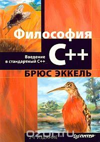
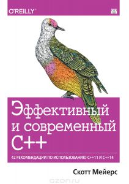
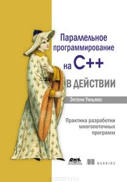

## Лекции

[https://github.com/mtrempoltsev/msu_cpp_lectures](https://github.com/mtrempoltsev/msu_cpp_lectures)

## Рекомендуемая литература

### Начальный уровень



#### Брюс Эккель, Философия С++

Книга старая, но довольно основательная.

### Продвинутый уровень

1. Стивен Дьюхерст, C++. Священные знания
2. Скотт Мейерс, смело можно читать все
3. Герб Саттер, аналогично

### Из относительно свежего




## Препроцессор, компилятор, компоновщик

Процесс трансляции исходного кода в виде текстового файла в представление, которое может быть выполнено процессором - сборка.

Состоит из 3 этапов:
1. Обработка исходного кода препроцессором (preprocessing)
2. Компиляция, то есть перевод подготовленного исходного кода в инструкции процессора (объектный файл) (compiling)
3. Компоновка - сборка одного или нескольких объектных файлов в один исполняемый файл (linking)

##### square.cpp

```c++
int square(int value)
{
    return value * value;
}
```

Это файл с исходным кодом, он содержит определения функций.

Компилируются cpp/c/etc файлы, один файл с исходным кодом - один объектный файл. **Это называется единица трансляции.**

> Удобный инструмент: [https://godbolt.org](https://godbolt.org)

```
g++ -c square.cpp
```

Вывод:

```
square.o
```

```
objdump -d square.o
```

```nasm
square.o:     file format elf64-x86-64

Disassembly of section .text:

0000000000000000 <_Z6squarei>:
   0:  55                     push   %rbp
   1:  48 89 e5               mov    %rsp,%rbp
   4:  89 7d fc               mov    %edi,-0x4(%rbp)
   7:  8b 45 fc               mov    -0x4(%rbp),%eax
   a:  0f af 45 fc            imul   -0x4(%rbp),%eax
   e:  5d                     pop    %rbp
   f:  c3                     retq
```

#### Секции

Блоки данных в откомпилированном файле. Это может быть:
- Код (.text)
- Статические данные (.data)
- Таблицы строк
- Таблицы символов (.symtab)

#### Символы

То, что находится в объектном файле - кортежи из имени, адреса и свойств:

- Имя - произвольная строка
- Адрес - число (смещение, адрес)
- Свойства 
 
#### Декорирование (mangling)

В С++ есть перегрузка функций (а еще есть классы), поэтому нужен механизм, чтобы различать перегруженные функции.

```c++
void print(int value); // _Z5printi
void print(const char* value); // _Z5printPKc
```

Инструмент для обратного преобразования:

```
c++filt _Z5printPKc
```

```
print(char const*)
```

#### extern "C"

```c++
extern "C"
{
    void print(int value); // print
}
```

##### main.cpp

```c++
int square(int value);

int main()
{
    return square(2);
}
```

```
objdump -d -r main.o
```

```nasm
0000000000000000 <main>:
   0:  55                     push   %rbp
   1:  48 89 e5               mov    %rsp,%rbp
   4:  bf 02 00 00 00         mov    $0x2,%edi
   9:  e8 00 00 00 00         callq  e <main+0xe>
      a: R_X86_64_PC32  _Z6squarei-0x4
   e:  5d                     pop    %rbp
   f:  c3                     retq 
```

> ```-r``` - информация о релокациях

#### Символы

Символ - кортеж из имени, адреса и свойств:

- Имя - произвольная строка
- Адрес - число (смещение, адрес)
- Свойства 

Связывание (binding) - говорит о том, виден ли символ вне файла:

- Локальный символ
- Глобальный символ
- Внешний символ

Смотрим таблицу символов:

```
objdump -t square.o
```

Вывод:

```
square.o:     file format elf64-x86-64

SYMBOL TABLE:
0000000000000000 l    df *ABS*  0000000000000000 square.cpp
0000000000000000 l    d  .text  0000000000000000 .text
0000000000000000 l    d  .data  0000000000000000 .data
0000000000000000 l    d  .bss  0000000000000000 .bss
0000000000000000 l    d  .note.GNU-stack  0000000000000000 .note.GNU-stack
0000000000000000 l    d  .eh_frame  0000000000000000 .eh_frame
0000000000000000 l    d  .comment  0000000000000000 .comment
0000000000000000 g     F .text  0000000000000010 _Z6squarei
```

Первая колонка - связывание:

- l - локальное
- g - глобальное
- пробел - ни один из вариантов

Седьмая колонка - тип, если стоит ```F``` - значит это функция.

```
readelf -s square.o
```

```
Symbol table '.symtab' contains 9 entries:
   Num:    Value          Size Type    Bind   Vis      Ndx Name
     0: 0000000000000000     0 NOTYPE  LOCAL  DEFAULT  UND 
     1: 0000000000000000     0 FILE    LOCAL  DEFAULT  ABS square.cpp
     2: 0000000000000000     0 SECTION LOCAL  DEFAULT    1 
     3: 0000000000000000     0 SECTION LOCAL  DEFAULT    2 
     4: 0000000000000000     0 SECTION LOCAL  DEFAULT    3 
     5: 0000000000000000     0 SECTION LOCAL  DEFAULT    5 
     6: 0000000000000000     0 SECTION LOCAL  DEFAULT    6 
     7: 0000000000000000     0 SECTION LOCAL  DEFAULT    4 
     8: 0000000000000000    16 FUNC    GLOBAL DEFAULT    1 _Z6squarei
```

```
objdump -t main.o
```

```
main.o:     file format elf64-x86-64

SYMBOL TABLE:
0000000000000000 l    df *ABS*  0000000000000000 main.cpp
0000000000000000 l    d  .text  0000000000000000 .text
0000000000000000 l    d  .data  0000000000000000 .data
0000000000000000 l    d  .bss  0000000000000000 .bss
0000000000000000 l    d  .note.GNU-stack  0000000000000000 .note.GNU-stack
0000000000000000 l    d  .eh_frame  0000000000000000 .eh_frame
0000000000000000 l    d  .comment  0000000000000000 .comment
0000000000000000 g     F .text  0000000000000010 main
0000000000000000         *UND*  0000000000000000 _Z6squarei
```

```
readelf -s main.o
```

```
Symbol table '.symtab' contains 10 entries:
   Num:    Value          Size Type    Bind   Vis      Ndx Name
     0: 0000000000000000     0 NOTYPE  LOCAL  DEFAULT  UND 
     1: 0000000000000000     0 FILE    LOCAL  DEFAULT  ABS main.cpp
     2: 0000000000000000     0 SECTION LOCAL  DEFAULT    1 
     3: 0000000000000000     0 SECTION LOCAL  DEFAULT    3 
     4: 0000000000000000     0 SECTION LOCAL  DEFAULT    4 
     5: 0000000000000000     0 SECTION LOCAL  DEFAULT    6 
     6: 0000000000000000     0 SECTION LOCAL  DEFAULT    7 
     7: 0000000000000000     0 SECTION LOCAL  DEFAULT    5 
     8: 0000000000000000    16 FUNC    GLOBAL DEFAULT    1 main
     9: 0000000000000000     0 NOTYPE  GLOBAL DEFAULT  UND _Z6squarei
```

##### main.cpp

```c++
int square(int value);

int main()
{
    return square(2);
}
```

##### square.h

```c++
int square(int value);
```

Это заголовочный файл, как правило в нем находятся объявления типов и функций.

##### main.cpp

```c++
#include "square.h"

int main()
{
    return square(2);
}
```

### Препроцессор

```
g++ -E main.cpp
```

Вывод:

```c++
# 1 "main.cpp"
# 1 "<built-in>"
# 1 "<command-line>"
# 1 "/usr/include/stdc-predef.h" 1 3 4
# 1 "<command-line>" 2
# 1 "main.cpp"
# 1 "square.h" 1
int square(int value);
# 2 "main.cpp" 2

int main()
{
    return square(2);
}
```

Директивы препроцессора:

- ```#include "name"``` - целиком вставляет файл с именем ```name```, вставляемый файл также обрабатывается препроцессором. Поиск файла происходит в директории с файлом, из которого происходит включение
- ```#include <name>``` - аналогично предыдущей директиве, но поиск производится в глобальных директориях и директориях, указанных с помощью ключа ```-I```
- ```#define x y``` - вместо ```x``` подставляет ```y```

> define - это опасно

```c++
#define true false // happy debugging
#define true !!(rand() % 2)
```

#### Условная компиляция

```
g++ -DDEBUG main.cpp
```

```c++
#define DEBUG
#ifdef DEBUG
    ...
#else
    ...
#endif
```

### Компиляция

```
g++ -c main.cpp
```

В результате мы имеем 2 файла:
- main.o
- square.o

### Компоновка

```
g++ -o my_prog main.o square.o
```

Вывод:

```
my_prog
```

```
./my_prog
echo $?
4
```

Компоновщик собирает из одного и более объектных файлов исполняемый файл.

### Что g++ делает под капотом

```
g++ -o my_prog -v main.cpp square.cpp
```

Вывод:

```
...

/usr/lib/gcc/x86_64-linux-gnu/5/cc1plus 
    main.cpp -o /tmp/ccjBvzkg.s

...

as -v --64 -o /tmp/ccM2mLyf.o /tmp/ccjBvzkg.s

...

/usr/lib/gcc/x86_64-linux-gnu/5/cc1plus 
    square.cpp -o /tmp/ccjBvzkg.s

...

as -v --64 -o /tmp/cc3ZpAQe.o /tmp/ccjBvzkg.s

...

/usr/lib/gcc/x86_64-linux-gnu/5/collect2 
    /tmp/ccM2mLyf.o /tmp/cc3ZpAQe.o 
    -lstdc++ -lm -lgcc_s -lgcc -lc -lgcc_s -lgcc
```

### Оптимизация

##### main.cpp

```c++
int square(int value)
{
    return value * value;
}

int main()
{
    return square(2);
}
```

```
g++ -c main.cpp
objdump -d main.o
```

```nasm
0000000000000010 <main>:
  10:  55                     push   %rbp
  11:  48 89 e5               mov    %rsp,%rbp
  14:  bf 02 00 00 00         mov    $0x2,%edi
  19:  e8 00 00 00 00         callq  1e <main+0xe>
  1e:  5d                     pop    %rbp
  1f:  c3                     retq 
```

```
g++ -O2 -c main.cpp
objdump -d main.o
```

```nasm
0000000000000000 <main>:
   0:  b8 04 00 00 00         mov    $0x4,%eax
   5:  c3                     retq 
```

### Статические библиотеки


```
ar rc libsquare.a squre.o
```

Вывод:

```
libsquare.a
```

> В unix принято, что статические библиотеки имеют префикс lib и расширение .a 

```
g++ -o my_prog main.o -L. -lsquare
```

```-L``` - путь в котором компоновщик будет искать библиотеки
```-l``` - имя библиотеки

> Статические библиотеки нужны только при сборке


### Ошибки при сборке

1. Компиляции
2. Компоновки

### Ошибки компоновки

#### Компоновщик не может найти символ

```
g++ -c math.cpp
g++ -o my_prog main.o 
```

```
main.o: In function `main':
main.cpp:(.text+0xa): undefined reference to `square(int)'
collect2: error: ld returned 1 exit status
```

##### Что делать?

Включить необходимый файл в сборку, если нет определения символа - написать его, проверить, что файлы созданы одинаковой версией компилятора и с одними опциями компиляции.

#### Символ встретился несколько раз - компоновщик не знает какую версию выбрать

##### math.cpp

```c++
int square(int value)
{
    return value * value;
}
```

```
g++ -c math.cpp
g++ -o my_prog main.o square.o math.o 
```

```
math.o: In function `square(int)':
math.cpp:(.text+0x0): multiple definition of `square(int)'
square.o:square.cpp:(.text+0x0): first defined here
collect2: error: ld returned 1 exit status
```

##### Что делать?

Убрать неоднозначность: переименовать одну из функций, поместить в другое пространство имен, изменить видимость и т.д.

### make

Утилита для автоматизации.

Синтаксис:

```
цель: зависимости
[tab] команда
```

Скрипт как правило находится в файле с именем **Makefile**.

Вызов:

```
make цель
```

Цель `all` вызывается, если явно не указать цель:

```
make
```

#### Плохой вариант

##### Makefile

```make
CC=g++

all: my_prog

my_prog: main.cpp square.cpp square.h 
    $(CC) -o my_prog main.cpp square.cpp

clean:
    rm -rf *.o my_prog
```

#### Хороший вариант

##### Makefile

```make
CC=g++

all: my_prog

my_prog: main.o square.o 
    $(CC) -o my_prog main.o square.o

main.o: main.cpp square.h
    $(CC) -c main.cpp

square.o: square.cpp square.h
    $(CC) -c square.cpp

clean:
    rm -rf *.o my_prog
```

EOF
