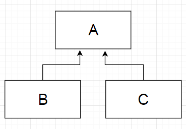
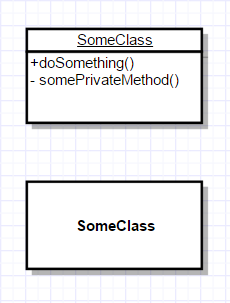
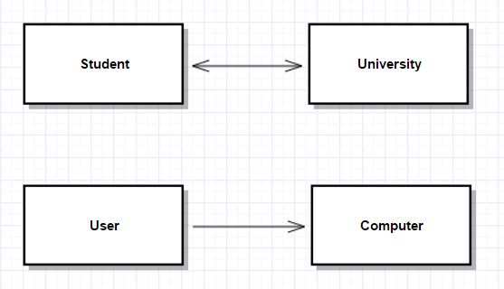
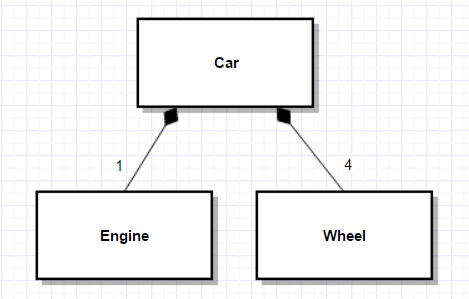
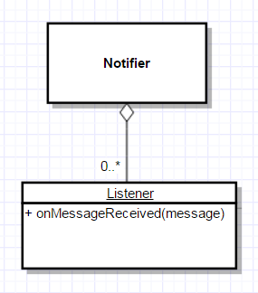
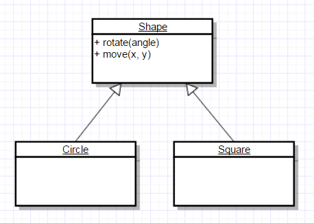
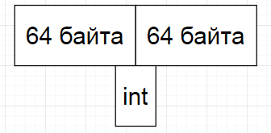

### Структуры и классы

#### Конструктор (ctor)

Служит для инициализации объекта.

Если конструктор не написан явно, С++ гарантирует, что будет создан конструктор по умолчанию.

```c++
struct A
{
    A() {}
};
```

##### Конструктор вызывается автоматически при создании объекта

```c++
// Выделение памяти в куче + вызов конструктора
A* x = new A();

// Выделение памяти на стеке + вызов конструктора
A y;
```

### Деструктор (dtor)

Если деструктор не написан явно, С++ гарантирует, что будет создан деструктор по умолчанию.

```c++
struct A
{
    ~A() {}
};
```

Служит для деинициализации объекта, **гарантированно вызыватся при удалении объекта**.

```c++
{
    A* x = new A();
    A y;
} // Выход из области видимости: 
  // вызов деструктора + освобождение 
  // памяти на стеке
  // Для х это означает, что
  // будет освобождена только память
  // занятая указателем, но та,
  // на которую он указывает
```

```c++
{
    A* x = new A();
    A y;
    delete x;
}
```

### RAII (Resource Acquire Is Initialization)

Захват ресурса есть инициализация.

В конструкторе объект получает доступ к какому либо ресурсу (например, открывается файл), а при вызове деструктура этот ресурс освобождается (закрывается файл).

```c++
class File
{
public:
    File(const char* fileName)
    {
        descriptor = open(fileName, O_CREAT);
    }

    ~File()
    {
        close(descriptor);
    }
};
```

> Можно использовать не только для управления ресурсами

```c++
struct Profiler
{
    Profiler() { // получаем текущее время }
    ~Profiler() { // сохраняем время между
        // выховами конструктора и деструктора }
};

void someFunction()
{
    Profiler p;
    if (...) return;
    ...
    if (...) return;
    ...
}
```

### Константные методы

```c++
struct A
{
    int x;
};

A a;
a.x = 3; // Ок

const A b;
b.x = 3; // Ошибка, константный
         // объект нельзя изменять

const A* c = &a;
c->x = 3; // Ошибка, константный
         // объект нельзя изменять
```

Любые методы кроме конструктора и деструктора могут быть константными.

```c++
class User
{
    using Year = uint32_t;
    Year age;
public:
    void setAge(Year value)
    {
        age = value;
    }

    bool canBuyAlcohol() const
    {
        return age >= 21;
    }
};

class UserDb
{
public:
    const User* getReadOnlyUser(
        const std::string& name) const
    {
        return db.find(name);
    }
};

const User* user = userDb.getReadOnlyUser("Bob");
user->setAge(21); // Ошибка
if (user->canBuyAlcohol()) // Ок
```

```c++
void User_setAge([User* const this], Year value)
{
    [this->]age = value;
}

bool User_canBuyAlcohol([const User* const this]) const
{
    return [this->]age >= 21;
}
```

### mutable

```c++
class Log
{
    void write(const std::string& text);
};

class UserDb
{
    mutable Log log;
public:
    const User& getReadOnlyUser(
        const std::string& name) const
    {
        log.write("...");
        return db.find(name);
    }
};
```

```c++
const User& UserDb_getReadOnlyUser(
    [const UserDb* const this],
    const std::string& name) const
{
    [this->]log.write("...");
    // Вызываем Log_write с const Log* const
}

void Log_write([Log* const this], const std::string& text)
{
    ...
}
```

### Перегрузка методов

> Методы классов - это просто функции, в которые неявно передается указатель на сам класс

```c++
class Connection
{
public:
    void send(int value);
    void send(const std::string& value);
};
```

> Конструкторы - это тоже функции и их тоже можно перегружать.

```c++
class Connection
{
public:
    Connection(const std::string& address, uint16_t port);
    Connection(const IpV4& address, uint16_t port);
    Connection(const IpV6& address, uint16_t port);
};
```

> Деструкторы - тоже функции, но перегружать нельзя.

### Параметры по умолчанию

```c++
class Connection
{
public:
    Connection(const std::string& address, uint16_t port = 8080);
};
```
```c++
class Connection
{
public:
    Connection(const std::string& address = "localhost", uint16_t port = 8080);
};
```

> Пропусков в параметрах по умолчанию быть не должно, начинаться они могут не с первого аргумента, но заканчиваться должны на последнем.

### Наследование

Возможность порождать класс на основе другого с сохранением всех свойств класса-предка.

Класс, от которого производится наследование, называется базовым, родительским или суперклассом. Новый класс – потомком, наследником, дочерним или производным классом.

```c++
class Shape
{
protected:
    int x;
    int y;
};

class Circle
    : public Shape
{
    int radius;
};
```

> Наследование моделирует отношение «является».

> Требуется для создания иерархичности – свойства реального мира.

### Представление в памяти при наследовании

#### Инструменты для исследования

- **sizeof(T)** - размер типа в байтах
- **offsetof(T, M)** - смещение поля M от начала типа T

```c++
struct A
{
    double x;
};

struct B
    : public A
{
    double y;
};

struct C
    : public B
{
    double z;
};

std::cout << sizeof(A) << std::endl; // 8
std::cout << sizeof(B) << std::endl; // 16
std::cout << sizeof(C) << std::endl; // 24

std::cout << offsetof(C, x) << std::endl; // 0
std::cout << offsetof(C, y) << std::endl; // 8
std::cout << offsetof(C, z) << std::endl; // 16
```

| Поле | Смещение | Доступность в типах |
|---|---|---|
| x | 0 | A, B, C |
| y | 8 | B, C |
| z | 16 | C |

```c++
C* c = new C();
c->x; // Ок
c->y; // Ок
c->z; // Ок

B* b = (B*) c;
b->x; // Ок
b->y; // Ок
b->z; // Ошибка компиляции

A* a = (A*) c;
a->x; // Ок
a->y; // Ошибка компиляции
a->z; // Ошибка компиляции
```

#### Приведение вверх и вниз по иерархии

##### Приведение вверх (к базовому классу) всегда безопасно.

```c++
void foo(A& a) {}

C c;
foo(c);
```

##### Приведение вниз может быть опасным

```c++
struct A {};
struct B : public A {};
struct C : public A {};
```



```
B* b = new B();
A* a = b;
C* c = a; // Ошибка компиляции
C* c = static_cast<C*>(b); // Ошибка компиляции
C* c = static_cast<C*>(a); // !!!
```

> Сохраняйте тип, пусть компилятор помогает писать корректный код!

> Общий базовый тип - плохая идея

### Композиция

```c++
class Car
{
    Engine engine;
    Wheels wheels[4];
};
```
> Композиция моделирует отношение «содержит/является частью»

### Агрегация

```c++
class Car
{
    Driver* driver_;
};
```

При агрегации класс не контролирует время жизни своей части.

### Унифицированный язык моделирования (Unified Modeling Language, UML)

UML – это открытый стандарт, использующий графические обозначения для создания абстрактной модели системы, называемой UML-моделью. UML используется для визуализации и документирования программных систем. UML не является языком программирования, но на основании UML-моделей возможна генерация кода.

UML редактор: [https://www.draw.io/](https://www.draw.io/)

### Диаграмма классов (Class diagram)

Статическая структурная диаграмма, описывающая структуру системы, демонстрирующая классы системы, их атрибуты, методы и зависимости между классами.

#### Классы

Видимость:

```
+ Публичный метод (public)
# Защищенный метод (protected)
- Приватный метод (private)
```



#### Ассоциация

Показывает, что объекты связаны, бывает однонаправленной и двунаправленной.



#### Композиция

Моделирует отношение «содержит/является частью».

При композиции класс явно контролирует время жизни своей составной части.



#### Агрегация

Моделирует отношение «содержит/является частью».

При агрегации класс не контролирует время жизни своей части.



#### Наследование

Моделирует отношение «является».



### Конструирование объекта

Порядок конструирования:
1. Выделяется память под объект
2. Если есть базовые классы, то конструирование начинается с них в порядке их очередности в списке наследования
3. Инициализируются поля класса в том порядке, в котором они объявлены в классе
4. Происходит вызов конструктора 

```c++
class A
{
public:
    A() {} // 3
    ~A() {}

private:
    int x; // 1
    int y; // 2
};

class B
    : public A
{
public:
    B() {} // 5
    ~B() {}

private:
    int z; // 4
};
```

Порядок уничтожения:
1. Происходит вызов деструктора
2. Вызываются деструкторы для полей класса в обратном порядке их объявления в классе
3. Уничтожаются базовые классы в порядке обратном списку наследования

```c++
class A
{
public:
    A() {}
    ~A() {} // 3

private:
    int x; // 5
    int y; // 4
};

class B
    : public A
{
public:
    B() {}
    ~B() {} // 1

private:
    int z; // 2
};
```

### Списки инициализации

```c++
class A
{
    A()
        : x(5)
        , y(6)
    {
        z = 7;
    }
    
    int x;
    int y;
    int z;
};
```

Распространенная ошибка:

```c++
class A
{
    A()
        : y(5) // Инициализация в порядке объявления в классе!
        , x(y)
    {
    }
    
    int x;
    int y;
};
```

### Инициализация в объявлении

```c++
class A
{
    int x = 3;
};
```

### Выравнивание полей

В целях повышения быстродействия данные в памяти должны быть выровнены, то есть размещены определенным образом.

Предпочтительное выравнивание можно узнать:

```c++
std::cout << alignof(char) << std::endl; // 1
std::cout << alignof(double) << std::endl; // 8
```

##### Гранулярность памяти



#### Инструменты для исследования

- **sizeof(T)** - размер типа в байтах
- **offsetof(T, M)** - смещение поля M от начала типа T

```c++
struct S
{
    char m1;
    double m2;
};
```

```c++
sizeof(char) == 1
sizeof(double) == 8
sizeof(S) == 16
offsetof(S, m1) == 0
offsetof(S, m2) == 8
```

```
[         char         ][        double        ]
[c][.][.][.][.][.][.][.][d][d][d][d][d][d][d][d]
```

Выравниванием можно управлять:
```c++
#pragma pack(push, 1)
class S
{
public:
    char m1;
    double m2;
};
#pragma pack(pop)

offsetof(S, m1) == 0
offsetof(S, m2) == 1
sizeof(S) == 9
```

> Работать будет не всегда, компилятор может это проигнорировать, если посчитает, что сделать это нельзя

#### Оптимизация размера POD структур

```c++
struct POD
{
    int x;
    double y;
    int z;
};

std::cout << sizeof(POD) << std::endl; // 24
```
```c++
struct POD
{
    double y;
    int x;
    int z;
};

std::cout << sizeof(POD) << std::endl; // 16
```

### Простые типы (POD, Plain Old Data)

1. Скалярные типы (bool, числа, указатели, перечисления (enum), nullptr_t)
2. class или struct которые:
    - Имеют только тривиальные (сгенерированные компилятором) конструктор, деструктор, конструктор копирования
    - Нет виртуальных функций и базового класса
    - Все нестатические поля с модификатором доступа public
    - Не содержит статических полей не POD типа

### Примеры

```c++
class NotPOD
{
public:
    NotPOD(int x)
    {
    }
};
```

```c++
class NotPOD
    : public Base
{
};
```

```c++
class NotPOD
{
    virtual void f()
    {
    }
};
```

```c++
class NotPOD
{
    int x;
};
```

```c++
class POD
{
public:
    NotPOD m1;
    int m2;
    static double m3;
private:
    void f() {}
};
```

> Копирование простого типа - memcpy

> Простые типы можно использовать для передачи из программы в программу, записи на диск и т.д. Но только на одной и той же платформе!

```c++
struct POD
{
    int x;
    double y;
    
    void serialize(File& file) const
    {
        file.write(this, sizeof(POD));
    }
};
```

### Инициализация POD типов

```c++
struct POD
{
    int x;
    double y;
};
```

Инициализация нулем (zero-initialization):

```c++
POD p1 = POD();
POD p2 {};
POD* p3 = new POD();

// x == 0
// y == 0
```

Инициализация по умолчанию (default-initialization):

```c++
POD p1;
POD* p2 = new POD;

// x, y содержат мусор
```

### Неявные приведения типов

```c++
int x = 5;
double y = x;
```

```c++
struct A
{
    A(int x) {}
};

A a = 5;
```
```c++
struct A
{
    A(int x, int y = 3) {}
};

A a = 5;
```
```c++
class BigInt
{
public:
    BigInt(int64_t value) {}
};

BigInt x = 5;
```

```c++
struct A
{
    explicit A(int x) {}
};

A a = 5; // Ошибка
```

### Операторы

##### Операторы сравнения

```c++
class BigInt
{
    static constexpr size_t Size = 256;
    uint8_t data_[Size];
public:
    bool operator==(const BigInt& other) const
    {
        if (this == &other)
            return true;

        for (size_t i = 0; i < Size; ++i)
            if (data_[i] != other.data_[i])
                return false;

        return true;
    }

    bool operator!=(const BigInt& other) const
    {
        return !(*this == other);
    }
};

BigInt x = 5;

if (c == 5)
    ...
```

Еще операторы сравнения:
- Меньше <
- Больше >
- Меньше или равно <=
- Больше или равно >=

##### Бинарные арифметические операторы

Попробуем написать метод осуществлющий сложение двух BigInt:

```c++
class BigInt
{
    const BigInt& operator+(BigInt& other)
    {
        ...
        return *this;
    }
};

BigInt x = 3;
BigInt y = 5;
BigInt z = x + y; // ок
BigInt z = x + y + x; // ошибка
```

```c++
// x + y -> const BigInt
tmp = x.operator+(y)
// tmp + z
tmp.operator+(x)
// opearator - не константный метод,
// a tmp - константный объект
```

```c++
class BigInt
{
    BigInt& operator+(BigInt& other)
    {
        ...
        return *this;
    }
};

BigInt x = 3;
BigInt y = 5;
BigInt z = x + y + x; // ок, но x изменился
```

```c++
class BigInt
{
    BigInt operator+(BigInt& other)
    {
        BigInt tmp;
        ...
        return tmp;
    }
};


BigInt x = 3;
BigInt y = 5;
BigInt z = x + y + x; // ок
```

```c++
BigInt x = 3;
const BigInt y = 5;
BigInt z = x + y + x; // передача константного
// объекта y по неконстантной ссылке
```

```c++
class BigInt
{
    BigInt operator+(const BigInt& other)
    {
        BigInt tmp;
        ...
        return tmp;
    }
};

BigInt x = 3;
const BigInt y = 5;
BigInt z = x + y + x; // ок
```

```c++
const BigInt x = 3;
const BigInt y = 5;
BigInt z = x + y + x; // передача константного
// объекта x по неконстантной ссылке
```

Финальный вариант:

```c++
class BigInt
{
    BigInt operator+(const BigInt& other) const
    {
        BigInt tmp;
        ...
        return tmp;
    }
};
```

Операторы могут не быть членами класса:

```c++
class Int128 {};
class BigInt
{
    BigInt operator+(const Int128& other) const
    {
        ...
    }
};
BigInt x = 3;
Int128 y = 5;
BigInt z = x + y; // ok
BigInt z = y + x; // у Int128 нет оператора
// сложения с BigInt
```

```c++
class BigInt
{
    friend BigInt operator+(const Int128& x, const BigInt& y);
};

BigInt operator+(const Int128& x, const BigInt& y)
{
    ...
}
```

Еще операторы:
- Вычитание -
- Деление /
- Умножение *
- Остаток от деления %

> Для операторов действует стандартный приоритет арифметических операторов

##### Унарные арифметические операторы

```c++
BigInt x = 3;
BigInt y = -x;

class BigInt
{
    bool isNegative_;
public:
    BigInt operator-() const
    {
        BigInt tmp(*this);
        tmp.isNegative_ = !isNegative_;
        return tmp;
    }
};
```

Для симметрии есть унарный плюс.

#### Операторы инкремента

```c++
Int x = 3;
++x;
x++;

class BigInt
{
    void increment()
    {
        ...
    }
public:
    // ++x
    BigInt& operator++()
    {
        increment();
        return *this;
    }
    // x++
    BigInt operator++(int)
    {
        BigInt tmp(*this);
        increment();
        return tmp;
    }
};
```

Операторы декремента аналогичны операторам инкремента.

##### Логические операторы

- Отрицание ! (унарный)
- И (логическое умножение) &&
- ИЛИ (логическое сложение) ||

##### Битовые операторы

- Инверсия ~
- И &
- ИЛИ |
- Исключающее ИЛИ (xor) ^
- Сдвиг влево <<
- Сдвиг вправо >>

##### Составное присваивание

Все арифметические, логические и побитовые операции только изменяющиие состояние объекта (с = в начале).

```c++
x += 3;
x *= 4;
```

```c++
class BigInt
{
    // не константный метод, так как объект изменяется
    void operator+=(const BigInt& other)
    {
        ...
    }
};
```

> Не канон

```
BigInt x = 3;
(x += 5) + 7;

class BigInt
{
    BigInt operator+=(const BigInt& other)
    {
        BigInt tmp;
        ...
        return tmp;
    }
};
```

##### Оператор вывода в поток

Не метод класса.

```c++
std::ostream& operator<<(std::ostream& out, const BigInt& value)
{
    out << ...;
    return out;
}

BigInt x = 5;
std::cout << x;
```

##### Операторы доступа

Семантика доступа к массиву.

```c++
class Array
{
    uint8_t* data_;
public:
    const uint8_t& operator[](size_t i) const
    {
        return data_[i];
    }

    uint8_t& operator[](size_t i)
    {
        return data_[i];
    }
};

Array a;
a[3] = 4;

const Array b;
b[5] = 6; // Ошибка
auto x = b[1]; // Ok
```

##### Семантика указателя

```c++
class MyObject
{
public:
    void foo() {}
};

class MyObjectPtr
{
    MyObject* ptr_;
public:
    MyObjectPtr()
        : ptr_(new MyObject())
    {
    }

    ~MyObjectPtr()
    {
        delete ptr_;
    }

    MyObject& operator*()
    {
        return *ptr_;
    }

    const MyObject& operator*() const
    {
        return *ptr_;
    }

    MyObject* operator->()
    {
        return ptr_;
    }

    const MyObject* operator->() const
    {
        return ptr_;
    }
};

MyObjectPtr p;
p->foo();
(*p).foo();
```

##### Функтор

Позволяет работать с объектом как с функцией.

```c++
class Less
{
public:
    bool operator()(
        const BigInt& left, const BigInt& right) const
    {
        return left < right;
    }
};

Less less;
if (less(3, 5))
    ...
```

##### Другие операторы

- new
- delete
- ,

### Сокрытие

```c++
struct A
{
    void foo() {} // 1
};

struct B
    : public A
{
    void foo() {} // 2
};

A a;
a.foo(); // Будет вызвана 1

B b;
b.foo(); // Будет вызвана 2

A* c = new B();
c->foo(); // Будет вызвана 1
```

### Виртуальные функции

```c++
struct A
{
    virtual void foo() const {} // 1
};

struct B
    : public A
{
    void foo() const override {} // 2
};

A a;
a.foo(); // Будет вызвана 1

B b;
b.foo(); // Будет вызвана 2

A* c = new B();
c->foo(); // Будет вызвана 2

const A& d = B();
d.foo(); // Будет вызвана 2
```

В первых двух случаях используется раннее (статическое) связывание, еще на этапе компиляции компилятор знает какой метод вызвать.

В третьем случае используется позднее (динамическое) связывание, компилятор на этапе компиляции не знает какой метод вызвать, выбор нужного метода будет сделан во время выполнения.

#### Виртуальные функции в С

```c++
#include <stdio.h>

struct Device
{
    virtual void write(const char* message) {}
};

class Console : public Device
{
    int id_;
public:
    Console(int id)
        : id_(id)
    {
    }

    void write(const char* message) override
    {
        printf("Console %d: %s\n", id_, message);
    }
};

class Socket : public Device
{
    const char* address_;
public:
    Socket(const char* address)
        : address_(address)
    {
    }

    void write(const char* message) override
    {
        printf("Send %s to %s\n", message, address_);
    }
};

int main()
{
    Device* devices[] = {
        new Console(10),
        new Socket("10.0.0.1") };

    Device* dev1 = devices[0];
    dev1->write("A");

    Device* dev2 = devices[1];
    dev2->write("B");

    return 0;
}
```

```
Console 10: A
Send B to 10.0.0.1
```

```C
#include <stdio.h>
#include <stdlib.h>

struct Device;

struct DeviceVirtualFunctionTable
{
    void (*write)(Device* self, const char* message);
};

struct Device
{
    DeviceVirtualFunctionTable vft_;
};

void Device_write(Device* self, const char* message)
{
    self->vft_.write(self, message);
}

struct Console
{
    DeviceVirtualFunctionTable vft_;
    int id_;
};

void Console_write(Device* self, const char* message)
{
    Console* console = (Console*) self;
    printf("Console %d: %s\n", console->id_, message);
}

Device* Console_new(int id)
{
    Console* instance = (Console*) malloc(sizeof(Console));
    instance->vft_.write = Console_write;
    instance->id_ = id;
    return (Device*) instance;
}

struct Socket
{
    DeviceVirtualFunctionTable vft_;
    const char* address_;
};

void Socket_write(Device* self, const char* message)
{
    Socket* socket = (Socket*) self;
    printf("Send %s to %s\n", message, socket->address_);
}

Device* Socket_new(const char* address)
{
    Socket* instance = (Socket*) malloc(sizeof(Socket));
    instance->vft_.write = Socket_write;
    instance->address_ = address;
    return (Device*) instance;
}

int main()
{
    Device* devices[] = {
        Console_new(10),
        Socket_new("10.0.0.1") };

    Device* dev1 = devices[0];
    Device_write(dev1, "A");

    Device* dev2 = devices[1];
    Device_write(dev2, "B");

    return 0;
}
```

```
Console 10: A
Send B to 10.0.0.1
```

##### Таблица виртуальных функций

Если в классе или в каком-либо его базовом классе есть виртуальная функция, то каждый объект хранит указатель на таблицу виртуальных функций.

Таблица представляет собой массив из указателей на функции.

```c++
struct A
{
    void foo() {}
    int x;
};

struct B
{
    virtual void foo() {}
    int x;
};

std::cout << sizeof(A) << '\n';
std::cout << sizeof(B) << '\n';
```

```
4
16
```

##### Виртуальный деструктор

```c++
struct A
{
    ~A()
    {
        std::cout << "A";
    }
};

struct B
    : public A
{
    ~B()
    {
        std::cout << "B";
        delete object_;
    }

    SomeObject* object_;
};

A* a = new B();
delete a;
```
```
A
```

> Произошла утечка, так как не был вызван деструктор, в котором мы освобождали ресурс.

```c++
struct A
{
    virtual ~A()
    {
    }
};
```

> Используете наследование? Сделайте деструктор виртуальным.

##### Чисто виртуальные функции (pure virtual)

```c++
class Writer
{
public:
    virtual void ~Writer() {}

    virtual void write(const char* message) = 0;
};

class ConsoleWriter
    : public Writer
{
public:
    void write(const char* message) override
    {
        std::cout << message;
    }
}
```

##### Абстрактные классы

Классы имеющие хоть одну чисто виртуальную функцию - абстрактные. При попытке создать их компилятор выдаст ошибку. Если в производном классе не сделать реализацию чисто виртуальной функции, то он тоже становится абстрактным.

> Абстрактные классы в С++ - продвинутые интерфейсные классы в других языках.

##### Виртуальные функции и параметры по умолчанию

```c++
struct A
{
    virtual void foo(int i = 10)
    {
        std::cout << i; // 1
    }
};

struct B
    : public A
{
    virtual void foo(int i = 20)
    {
        std::cout << i; // 2
    }
};

A* a = new B();
a->foo(); // Будет вызвана 2, вывод 10

B* b = new B();
b->foo(); // Будет вызвана 2, вывод 20

A* a = new A();
a->foo(); // Будет вызвана 1, вывод 10
```

> Лучше избегать параметров по умолчанию для виртуальных функций

### Модификаторы доступа при наследовании

```c++
class A
{
public:
    int x_;
protected:
    int y_;
private:
    int z_;
};
```

Псевдокод! Поля базового класса после наследования имеют такие модификаторы:

```c++
class B : public A
{
public:
    int x_;
protected:
    int y_;
};

A* a = new B(); // Ok
```
```c++
class B : protected A
{
protected:
    int x_;
    int y_;
};

A* a = new B(); // Ошибка
```
```c++
class  B : private A
{
private:
    int x_;
    int y_;
};

A* a = new B(); // Ошибка
```

##### public - классическое ООП наследование

```c++
class Device
{
};

class NetworkAdapter
    : public Device
{
};

class DeviceManager
{
    void addDevice(Device* dev)
    {
    }
}

devManager.addDevice(new NetworkAdapter());
```

##### private - наследование реализации

```c++
class NetworkAdapter
    : public Device
    , private Loggable
{
};

Loggable* l = new NetworkAdapter(); // Ошибка
```

#### final

```c++
struct A final
{
};

struct B : public A // Ошибка
```

### Множественное наследование

```c++
struct A
{
    virtual ~A() {}
    double x;
    double y;
};

struct B : public A { };

struct C : public A { };

struct D
    : public B
    , public C
{
};
```

```
+------+ +------+
|  A   | |  A   |
| x, y | | x, y |
| vtab | | vtab |
+------+ +------+
    ^       ^
    |       |
+------+ +------+
|  B   | |  C   |
+------+ +------+
     ^    ^
     |    |
    +------+
    |  D   |
    +------+
```

```c++
// 2 * 8(double) + 1 * 8(vtable)
sizeof(A) == 24
sizeof(B) == 24
sizeof(C) == 24
// (2 * 8(double) + 1 * 8(vtable)) + (2 * 8(double) + 1 * 8(vtable))
sizeof(D) == 48
```

```
[A][B][D]
         [A][C]
```

```c++
struct A
{
    A(double x)
        : x(x)
        , y(0)
    {
    }
    virtual ~A() {}
    double x;
    double y;
};

struct B : public A
{
    B(double x)
        : A(x)
    {
        y = x * 2;
    }
};

struct C : public A
{
    C(double x)
        : A(x)
    {
        y = x * 2;
    }
};

struct D
    : public B
    , public C
{
    D()
        : B(2)
        , C(3)
    {
        B::y = 1;
        C::y = 2;
    }
};
```

#### Ромбовидное наследование

```c++
struct A
{
    virtual ~A() {}
    double x;
    double y;
};

struct B : virtual public A { };

struct C : virtual public A { };

struct D
    : public B
    , public C
{
};
```

```
    +------+
    |  A   |
    | x, y |
    | vtab |
    +------+
     ^    ^
     |    |
+------+ +------+
|  B   | |  C   |
| vtab | | vtab |
+------+ +------+
     ^    ^
     |    |
    +------+
    |  D   |
    +------+
```

```c++
// 2 * 8(double) + 1 * 8(vtable)
sizeof(A) == 24
// 2 * 8(double) + 2 * 8(vtable)
sizeof(B) == 32
sizeof(C) == 32
// 2 * 8(double) + 3 * 8(vtable)
sizeof(D) == 40
```

```
[B][D]
      [C]
         [A]
```

### Вложенные классы

```c++
class Vector
{
public:
    class Iterator
    {
    };

private:
    char* data_;
};

Vector::Iterator it = ...
```

> Имеют доступ к закрытой части внешнего класса

### Практическая часть

Нужно написать класс-матрицу, тип элементов int. В конструкторе задается количество рядов и строк. Поддерживаются оперции: получить количество строк(rows)/столбцов(columns), получить конкретный элемент, умножить на число(*=), сравнение на равенство/неравенство. В случае ошибки выхода за границы бросать исключение:

```c++
throw std::out_of_range("")
```

Пример:

```c++
const size_t rows = 5;
const size_t cols = 3;

Matrix m(rows, cols);

assert(m.getRows() == 5);
assert(m.getColumns() == 3);

m[1][2] = 5; // строка 1, колонка 2
double x = m[4][1];

m *= 3; // умножение на число

Matrix m1(rows, cols);

if (m1 == m)
{
}
```

##### Подсказка

Чтобы реализовать семантику [][] понадобится прокси-класс. Оператор матрицы возращает другой класс, в котором тоже используется оператор [] и уже этот класс возвращает значение.

EOF
