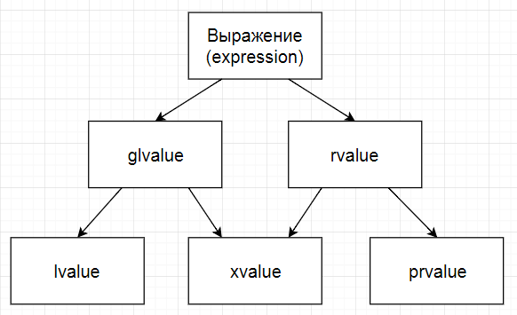

### Argument-dependent name lookup (ADL)

Известен также, как Koenig lookup.

```c++
namespace X
{
    struct A { ... };

    std::ostream& operator<<(
        std::ostream& out, const A& value) { ... }
        
    void foo(const A& value) { ... }
}

X::A a;

std::cout << a;
foo(a);
```

Компилятор ищет функцию в текущем пространстве имен и если не находит, то в пространствах имен аргументов. Если находит подходящую функцию в двух местах, то возникает ошибка.

### Методы генерируемые компилятором неявно

```c++
struct A
{
    X x;
    Y y;
    // Конструктор
    A()
        : x(X())
        , y(Y())
    {}
    // Деструктор
    ~A()
    {}
    // Копирующий конструктор
    // A a1;
    // A a2 = a1;
    A(const A& copied)
        : x(copied.x)
        , y(copied.y)
    {}
    // Оператор копирования
    // A a1;
    // A a2;
    // a2 = a1;
    A& operator=(const A& copied)
    {
        x = copied.x;
        y = copied.y;
        return *this;
    }
    // Перемещающий конструктор
    // A a1;
    // A a2 = std::move(a1);
    A(A&& moved)
        : x(std::move(moved.x))
        , y(std::move(moved.y))
    {}
    // Оператор перемещения
    // A a1;
    // A a2;
    // a2 = std::move(a1);
    A& operator=(A&& moved)
    {
        x = std::move(moved.x);
        y = std::move(moved.y);
        return *this;
    }
};
```

### Правило тройки (пятерки)

Если явно объявить один из следующих методов:

- деструктор
- конструктор копирования
- оператор копирования

(после С++11, еще два)

- конструктор перемещения
- оператор перемещения

То компилятор не будет генерировать остальные автоматически, поэтому если они вам нужны, вы должны реализовать их самостоятельно.

### Копирование

Семантика: в результате копирования должна появится точная копия объекта.

```c++
String a;
String b = a;
String c;
c = a;
// a == b == c
```

```c++
class String
{
    size_t size_;
    char* data_;
public:
    ~String()
    {
        delete[] data_;
    }

    // String b1;
    // String b2 = b1;
    String(const String& copied)
        : data_(new char[copied.size_])
        , size_(copied.size_)
    {
        std::copy(copied.data_, copied.data_ + size_, data_);
    }
    
    // String b1;
    // String b2;
    // b2 = b1;
    String& operator=(const String& copied)
    {
        // Плохо
        delete[] data_;
        data_ = new char[copied.size_];
        size_ = copied.size_;
        std::copy(copied.data_, copied.data_ + size_, data_);
        return *this;
    }
};
```

```c++
String b1;
b1 = b1;

std::vector<String> words;
...
words[to] = words[from];
```

Проверяйте на присваивание самому себе.

```c++
String& operator=(const String& copied)
{
    if (this == &copied)
        return *this;
    // Плохо
    delete[] data_;
    data_ = new char[copied.size_];
    size_ = copied.size_;
    std::copy(copied.data_, copied.data_ + size_, data_);
    return *this;
}
```

Финальный вариант:

```c++
String& operator=(const String& copied)
{
    if (this == &copied)
        return *this;
    char* ptr = new char[copied.size_];
    delete[] data_;
    data_ = ptr;
    size_ = copied.size_;
    std::copy(copied.data_, copied.data_ + size_, data_);
    return *this;
}
```

> Подумайте, а стоит ли писать конструктор/оператор копирования самостоятельно?

##### Копирование и наследование

```c++
struct A
{
    A() {}
    A(const A& a) {}
    virtual A& operator=(const A& copied)
        { return *this; }
};

class B
    : public A
{
public:
    B() {}

    B(B& b)
        : A(b)
    {
    }

    A& operator=(const A& copied) override
    {
        A::operator=(copied);
        return *this;
    }
};
```

##### Срезка

```c++
void foo(A a)
{
    // Срезанный до А объект
}

B a;
foo(a);
```

##### Нежелательное копирование

```c++
void print(std::vector<char> data)
{
    ...
}
```

```c++
void print(const std::vector<char>& data)
```

Используйте передачу по ссылке!

##### Явный запрет копирования

Олдскул:

```c++
class Noncopyable
{
    Noncopyable(const Noncopyable&);
    Noncopyable& operator=(const Noncopyable&);
};

class Buffer
    : private Noncopyable
{
};
```

`boost::noncopyable` устроен именно так.

С++11:

```c++
class Buffer
{
    Buffer(const Buffer&) = delete;
    Buffer& operator=(const Buffer&) = delete;
};
```

##### Явное указание компилятору сгенерировать конструктор и оператор копирования

```c++
class Buffer
{
public:
    Buffer(const Buffer&) = default;
    Buffer& operator=(const Buffer&) = default;
};
```

### Перемещение

Семантика: в результате перемещения в объекте, куда происходит перемещение, должна появиться точная копия перемещаемого объекта, оригинальный объект после этого остается в неопределенном, но корректном состоянии.

### lvalue и rvalue

> "Объект - это некоторая **именованная область памяти**; lvalue - это выражение, обозначающее объект. Термин "lvalue" произошел от записи присваивания Е1 = Е2, в которой левый (left - левый(англ.), отсюда буква l, value - значение) операнд Е1 должен быть выражением lvalue."

*Керниган и Ритчи*

```c++
int a = 1;
int b = 2;
int c = (a + b);
int foo() { return 3; }
int d = foo();

1 = a; // left operand must be l-value
foo() = 2; // left operand must be l-value
(a + b) = 3; // left operand must be l-value
```

1. Если можно взять адрес - lvalue
2. Все что не lvalue, то rvalue



```c++
struct A 
{
    A() {}
    A(int) {}
};

A global;

A foo() { return A(); }
A& bar() { return global; }
A operator+(const A& x, const A& y) { ... }
```

##### glvalue ("generalized" lvalue)

Обозначает объект, битовое поле или функцию.

```c++
A a; // a - glvalue
```

##### prvalue ("pure" rvalue)

То, что инициализирует объект или битовое поле. Или это вычислямый аргумент вызова функции.

```c++
A a = A(); // A() - prvalue
A b = foo(); // то, что вернет foo - prvalue
A c = a + 1; // A(1) - prvalue
```

##### xvalue ("eXpiring" value)

Это glvalue, которое обозначает объект или битовое поле, ресурсы которого могут быть повторно использованы, так как время жизни объекта или битового поля близко к завершению.

##### lvalue

Это glvalue, которое не xvalue.

##### rvalue

Это prvalue или xvalue.

```c++
int a = 3;

int foo() { return 4; }
int b = foo();

int c = a + b;
```

> rvalue это временные объекты, которые уничтожаются в конце выражения, они  не имеют имён, и вызывающий код не имеет возможности дальнейшего их использования.

##### Пример

```c++
void foo(int) {}
void foo(int&) {}
void foo(int&&) {}
```

```c++
void foo(int) {} // <-- этот?
void foo(int&) {} //  // <-- или этот?
void foo(int&&) {}

int x = 1;
foo(x);
```

```c++
void foo(int) {} // <-- этот?
void foo(int&) {} // <-- или этот?
void foo(int&&) {}

int x = 1;
int& y = x;
foo(y);
```
```c++
void foo(int) {} // <-- этот?
void foo(int&) {}
void foo(int&&) {} // <-- или этот?

foo(1);
```
```c++
int bar() { return 1; }

void foo(int) {} // <-- этот?
void foo(int&) {}
void foo(int&&) {} // <-- или этот?

foo(bar());
```
```c++
void foo(int) {} // <-- этот?
void foo(int&) {}
void foo(int&&) {} // <-- или этот?

foo(1 + 2);
```

#### Конструктор/оператор перемещения

```c++
class Buffer
{
    size_t size_;
    char* data_;
public:
    ~Buffer()
    {
        delete data_;
    }

    // Buffer b1;
    // Buffer b2 = std::move(b1);
    Buffer(Buffer&& moved)
        : data_(moved.data_)
        , size_(moved.size_)
    {
        moved.data_ = nullptr;
        moved.size_ = 0;
    }

    // Buffer b1;
    // Buffer b2;
    // b2 = std::move(b1);
    Buffer& operator=(Buffer&& moved)
    {
        if (this == &moved)
            return *this;
        delete[] data_;
        data_ = moved.data_;
        size_ = moved.size_;
        moved.data_ = nullptr;
        moved.size_ = 0;
        return *this;
    }
};
```

##### Где уместно перемещение?

Захват владения:

```c++
RequestHandler handler;
handler.setup(...);

Server server(std::move(handler));

Buffer buffer;
server.useBuffer(std::move(buffer));
```

Оптимальный код:

```c++
std::vector<Object> objects;
```

##### Явное указание компилятору сгенерировать конструктор и оператор перемещения

```c++
class Buffer
    : private Noncopyable
{
public:
    Buffer(Buffer&&) = default;
    Buffer& operator=(Buffer&&) = default;
};
```

##### Perfect forwarding

Задача: передать аргумент не создавая временных копий.

```c++
void foo(T x)
{
    // копия
    bar(x);
}
```

```c++
void foo(T& x)
{
    bar(x);
}

Может приводить к ошибкам компиляции, если x - rvalue:

foo(5);
```

```c++
void foo(T&& x)
{
    bar(std::forward<T>(x));
}
```

```c++
Server makeServer(std::string&& address)
{
    Server server(std::forward<std::string>(address));
    server.setup(...);
    return server;
}
```

##### Return value optimization (RVO)

Позволяет сконструировать возвращаемый объект в точке вызова.

```c++
Server makeServer(uint16_t port)
{
    Server server(port);
    server.setup(...);
    return server;
}

Server s = makeServer(8080);
```

Не мешайте компилятору:

```c++
Server&& makeServer(uint16_t port)
{
    Server server(port);
    server.setup(...);
    return std::move(server); // так не надо
}
```

##### Copy elision

Оптимизация компилятора разрешающая избегать лишнего вызова копирующего конструктора.

```c++
struct A
{
    explicit A(int) {}
    A(const A&) {}
};

A y = A(5); // Копирующий конструктор вызван не будет
```

> В копирующих конструкторах должна быть логика отвечающая только за копирование.

### Шаблоны

##### Шаблоны классов

```c++
class Matrix
{
    double* data_;
};
```

```c++
template <class T>
class Matrix
{
    T* data_;
};
```

```c++
Matrix<double> m;
Matrix<int> m;
```

```c++
class MatrixDouble
{
    double* data_;
};

class MatrixInt
{
    int* data_;
};
```

##### Шаблоны функций

```c++
template <class T>
void printLine(const T& value)
{
    std::cout << value << '\n';
}
```
```c++
printLine<int>(5);
```

Компилятор может самостоятельно вывести тип шаблона в зависимости от аргументов вызова.

```c++
printLine(5);
```

##### class или typename

```c++
template <class T>
void printLine(const T& value)
{
}
```
```c++
template <typename T>
void printLine(const T& value)
{
}
```

Никакой разницы.

### Практическая часть

Написать класс для работы с большими целыми числами. Размер числа ограничен только размером памяти. Нужно поддержать семантику работы с обычным int:

```c++
BigInt a = 1;
BigInt b = a;
BigInt c = a + b + 2;
```

Реализовать оператор вывода в поток, сложение, вычитание, унарный минус, все операции сравнения.

std::vector и другие контейнеры использовать нельзя - управляйте памятью сами.

EOF