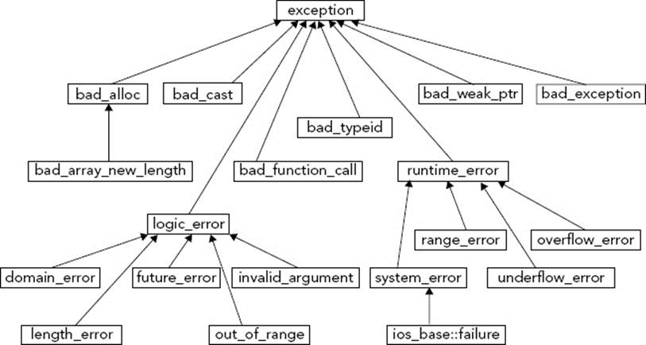
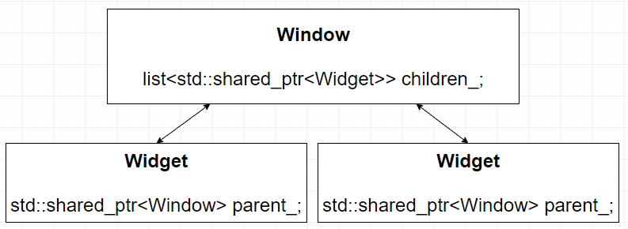

## Обработка ошибок

1. Возврат кода ошибки
2. Исключения

### Возврат кода ошибки

```c++
enum class Error
{
    Success,
    Failure
};

Error doSomething()
{
    return Error::Success;
}

if (doSomething() != Error::Success)
{
    showError();
}
```

\+ Простота

\- Ошибку можно проигнорировать

\- Делает код громозким

```c++
auto data = readData("data.json");

Json data;
auto error = readData(data, "data.json");
if (error != Success)
{
    ...
}
```

#### Поддержка со стороны C++

```c++
#include <system_error>
```

```c++
enum class HttpError
{
    NoError = 200,
    NotFound = 404
};

class HttpCategory:
    public std::error_category
{
public:
    const char* name() const noexcept override
    {
        return "http";
    }

    std::string message(int code) const override
    {
        switch (code)
        {
        case 200: return "ok";
        case 404: return "not found";
        }
        assert(!"invalid error code");
    }
};

std::error_code make_error_code(HttpError error)
{
    static const HttpCategory instance;
    return std::error_code(
        static_cast<int>(error),
        instance);
}
```

```c++
std::error_code download(const std::string& url)
{
    return make_error_code(HttpError::NotFound);
}

const auto error = download("http://1.1.1.1");
if (error)
{
    std::cerr << error << '\n';
    std::cerr << error.message() << '\n';
}
```

```
http:404
not found
```

### Исключения

\- Вопросы производительности

\- При неправильном использовании могут усложнить программу

\+ Нельзя проигнорировать

```c++
struct Error
{
    std::string message_;
    const char* fileName_;
    int line_;
    Error(const std::string& message,
        const char* fileName, int line)
        : message_(message)
        , fileName_(fileName)
        , line_(line)
    {
    }
};

void doSomething()
{
    throw Error(
        "doSomething error", __FILE__, __LINE__);
}

try
{
    doSomething();
}
catch (const Error& error)
{
    showError();
}
```

#### Что такое исключительная ситуация?

Ошибка которую нельзя обработать на данном уровне и игнорирование которой делает дальнейшую работу программы бессмысленной.

#### Гарантии безопасности исключений (exception safety)

1. Гарантировано искючений нет (No-throw guarantee)

Операции всегда завершаются успешно, если исключительная ситуация возникла она обрабатывается внутри операции.

2. Строгая гарантия (Strong exception safety)

Также известна как коммит ролбек семантика (commit/rollback semantics). Операции могут завершиться неудачей, но неудачные операции гарантированно не имеют побочных эффектов, поэтому все данные сохраняют свои исходные значения.

```c++
std::vector<int> source = ...;
try
{
    std::vector<int> tmp = source;
    tmp.push_back(getNumber());
    tmp.push_back(getNumber()); <-- Исключение
    tmp.push_back(getNumber());
    source.swap(tmp);
}
catch (...)
{
    return;
}
```

3. Базовая гарантия (Basic exception safety)

Выполнение неудачных операций может вызвать побочные эффекты, но все инварианты сохраняются и нет утечек ресурсов (включая утечку памяти). Любые сохраненные данные будут содержать допустимые значения, даже если они отличаются от того, что они были до исключения.

```c++
source.push_back(getNumber());
source.push_back(getNumber()); <-- Исключение
source.push_back(getNumber());
```

4. Никаких гарантий (No exception safety)

#### Поиск подходящего обработчика

```c++
class Error {};

class ArgumentError : public Error
{
    std::string message_;
public:
    ArgumentError(std::string&& message);
    const std::string& getMessage() const;
};

File openFile(const std::string& name)
{
    if (name.empty())
        throw ArgumentError("empty file name");
}

try
{
    auto file = openFile("data.json");
    auto json = file.readAll();
}
catch (const ArgumentError& error)
{
    std::cerr << error.getMessage();
}
catch (const Error& error)
{
}
catch (...)
{
}
```

1. Поиск подходящего обработчика идет в порядке следования обработчиков в коде
2. Полного соответствия типа не требуется, будет выбран первый подходящий обработчик
3. Если перехватывать исключение по значению, то возможна срезка до базового класса
4. Если наиболее общий обработчик идет раньше, то более специализированный обработчик никогда не будет вызван
5. Три точки - перехват любого исключения

> Исключения ОС - не исключения С++, например, деление на ноль. Для их обработки нужно использовать средства предоставляемые конкретной платформой

#### Раскрутка стека

```c++
struct A {};
struct Error {};
struct FileError : public Error {};

void foo()
{
    A a1;
    throw Error();
}

void bar()
{
    A a2;
    try
    {
        A a3;
        foo();
    }
    catch (const FileError&)
    {
    }
}

bar();
```

Поиск подходящего обработчика вниз по стеку вызовов с вызовом деструкторов локальных объектов - раскрутка стека.

Если подходящий обработчик не был найден вызывается стандартная функция terminate.

#### terminate

Вызывает стандартную функцию С - abort.

abort - аварийное завершение программы, деструкторы объектов вызваны не будут.

Поведение terimnate можно изменить установив свой обработчик функцией set_terminate.

##### Где уместен catch (...)?

Только в main, для того, чтобы поймать необработанное исключение, чтобы избежать вызов terminate и таким образом завершить работу с вызовом деструкторов.

```c++
int main()
{
    try
    {
        ...
    }
    catch (...)
    {
        std::cerr << "unknown error";
    }
}
```

#### Перезапуск исключения

```c++
try
{
    foo();
}
catch (...)
{
    std::cerr << "something wrong";
    throw;
}
```

#### noexcept

```c++
void foo() noexcept
{
}
```

noexcept говорит компилятору, что функция не выбрасывает исключений - это позволяет компилятору генерировать более компактный код, но если фактически исключение было выброшено, то будет вызвана функция terminate.

#### Исключения в деструкторе

Исключение покинувшее деструктор во время раскрутки стека или у глобального/статического объекта приведет к вызову terminate.

Начиная с С++11 все деструкторы компилятором воспринимаются как помеченные noexcept - теперь исключения не должны покидать деструктора никогда.

#### Исключения в конструкторе

Клиент либо получает объект в консистентном состоянии, либо не получает ничего.

```c++
class Socket
{
    static constexpr size_t BufferSize = 2048;
    char* buffer_;
public:
    explicit Socket(const std::string& address)
        : data_(new char[BufferSize]) // <- утечка
    {
        if (address.empty())
            throw ArgumentError();
    }
    
    ~Socket()
    {
        delete[] buffer_; // Не будет вызван
    }
};
```

Для полностью сконструированных на момент выброса исключения объектов будут вызваны деструкторы, память выделенная под объект будет корректно освобождена, но поскольку объект не был полностью сконструирован, то деструктор вызван не будет.

### Стандартные классы рекомендуемые для исключений

```c++
#include <stdexcept>
```


```c++
class exception
{
public:
    explicit exception(char const* const message);

    virtual char const* what() const;
```

#### Управление ресурсами

Используем идеому RAII (Resource Acquire Is Initialization):

```c++
struct Buffer
{
    explicit Buffer(size_t size)
        : data_(new char[size])
    {
    }
    
    ~Buffer()
    {
        delete[] data_;
    }
    
    char* data_;
};
```

```c++
class Socket
{
    static constexpr size_t BufferSize = 2048;
    Buffer buffer_;
public:
    explicit Socket(const std::string& address)
        : buffer_(BufferSize)
    {
        if (address.empty())
            throw ArgumentError();
    }
};
```

### Исключения под капотом

```c++
struct A
{
    A() {}
    ~A() {}	
};

void bar() noexcept
{
}

void foo()
{
    A a;
    bar();
}
```

```nasm
A::A() [base object constructor]:
        ret
A::~A() [base object destructor]:
        ret
bar(): 
        ret
foo():
        push    rbp
        mov     rbp, rsp
        sub     rsp, 16
        lea     rdi, [rbp - 8]
        call    A::A() [base object constructor]
        call    bar()
        lea     rdi, [rbp - 8]
        call    A::~A() [base object destructor]
        add     rsp, 16
        pop     rbp
        ret
```

##### Убираем noexcept

```c++
struct A
{
    A() {}
    ~A() {}	
};

void bar() {}

void foo()
{
    A a;
    bar();
}
```

```nasm
A::A() [base object constructor]:
        ret
A::~A() [base object destructor]:
        ret
bar(): 
        ret
foo():
        call    A::A() [base object constructor]
        call    bar()
        jmp     .LBB1_1
.LBB1_1:
        call    A::~A() [base object destructor]
        ret
.LBB1_2: # landing pad
        call    A::~A() [base object destructor]
        call    _Unwind_Resume
```

Появился специальный блок (landing pad) используемый при раскрутке стека.

##### Добавляем блок catch

```c++
struct A
{
    A() {}
    ~A() {}	
};

void bar() {}

void baz() noexcept {}

void foo()
{
    A a;
    try
    {
        bar();
    }
    catch (...)
    {
        baz();
    }
}
```

```nasm
foo():
        call    A::A() [base object constructor]
        call    bar()
        jmp     .LBB2_1
.LBB2_1:
        jmp     .LBB2_5
.LBB2_2:
        call    __cxa_begin_catch
        call    baz()
        call    __cxa_end_catch
        jmp     .LBB2_4
.LBB2_4:
        jmp     .LBB2_5
.LBB2_5:
        call    A::~A() [base object destructor]
        ret
.LBB2_6:
        call    A::~A() [base object destructor]
        call    _Unwind_Resume
```

##### Выбрасываем исключение

```c++
struct A
{
    A() {}
    ~A() {}	
};

void bar()
{
    throw A();
}

void baz() noexcept
{
}

void foo()
{
    A a;
    try
    {
        bar();
    }
    catch (...)
    {
        baz();
    }
}
```

```nasm
bar():
        call    __cxa_allocate_exception
        call    A::A() [base object constructor]
        jmp     .LBB0_1
.LBB0_1:
        call    __cxa_throw
.LBB0_2: # landing pad
        call    __cxa_free_exception
        call    _Unwind_Resume
foo():
        call    A::A() [base object constructor]
        call    bar()
        jmp     .LBB4_1
.LBB4_1:
        jmp     .LBB4_5
.LBB4_2:
        call    __cxa_begin_catch
        call    baz()
        call    __cxa_end_catch
        jmp     .LBB4_4
.LBB4_4:
        jmp     .LBB4_5
.LBB4_5:
        call    A::~A() [base object destructor]
        ret
.LBB4_6:
        call    A::~A() [base object destructor]
        call    _Unwind_Resume
typeinfo name for A:
        .asciz  "1A"
typeinfo for A:
        .quad   vtable for __cxxabiv1::__class_type_info+16
        .quad   typeinfo name for A
```

##### Компиляция с включенной оптимизацией

```c++
struct A
{
    A() {}
    ~A() {}	
};

void bar(int x)
{
    if (x == 1)
        throw A();
}

void baz() noexcept
{
}

void foo(int x)
{
    A a;
    try
    {
        bar(x);
    }
    catch (...)
    {
        baz();
    }
}
```

```nasm
bar(int):
        cmp     edi, 1
        je      .LBB0_2
        ret
.LBB0_2:
        call    __cxa_allocate_exception
        call    __cxa_throw
foo(int):
        cmp     edi, 1
        je      .LBB3_1
        ret
.LBB3_1:
        call    __cxa_allocate_exception
        call    __cxa_throw
.LBB3_3:
        call    __cxa_begin_catch
        jmp     __cxa_end_catch         # TAILCALL
typeinfo name for A:
        .asciz  "1A"
typeinfo for A:
        .quad   vtable for __cxxabiv1::__class_type_info+16
        .quad   typeinfo name for A
```

### Управление памятью

Стандартная библиотека предлагает два умных указателя для автоматического управления памятью:

1. unique_ptr
2. shared_ptr / weak_ptr

#### unique_ptr

- Монопольное владение памятью, в конструкторе захват, в деструкторе освобождение
- Копирование запрещено, перемещение разрешено

```c++
std::unique_ptr<MyClass> x(new MyClass());
auto y = std::make_unique<MyClass>(); // C++14

std::unique_ptr<char[]> z(new char[1024]);
```

#### shared_ptr

- Совместное владение памятью
- Копирование увеличивает счетчик ссылок
- В деструкторе счетчик уменьшается и если становится равным 0, то объект уничтожается

```c++
std::shared_ptr<MyClass> x(new MyClass());
auto y = std::make_shared<MyClass>();
```

#### Точки следования (sequence points)

Точки следования - это точки в программе, где состояние реальной программы полностью соответствует состоянию следуемого из исходного кода.

Точки следования необходимы для того, чтобы компилятор мог делать оптимизацию кода.

```c++
// Может быть утечка
foo(
    std::shared_ptr<MyClass>(new MyClass()), 
    bar());
```

Компилятор может заменить это выражение на следующее:

```c++
auto tmp1 = new MyClass();
auto tmp2 = bar();
auto tmp3 = std::shared_ptr<MyClass>(tmp1);
foo(tmp1, tmp3);
```

Если из bar вылетит исключение, то объект на который указывает tmp1 будет некому удалить.

Решение 1:

```c++
std::shared_ptr<MyClass> x(new MyClass());
foo(x, bar()); // ok
```

Решение 2:

```c++
foo(std::make_shared<MyClass>(), bar()); // ok
```

Местонахождение точек:

1. В конце каждого полного выражения - ;
2. В точке вызова функции после вычисления всех аргументов
3. Сразу после возврата функции, перед тем как любой другой код из вызвавшей функции начал выполняться
4. После первого выражения (а) в следующих конструкциях:

```c++
    a || b 
    a && b
    a, b
    a ? b : c
```

Если программа пытается модифицировать одну переменную дважды не пересекая точку следования, то это ведет к неопределенному поведению (undefined behavior):

```c++
int x = 0;
x = x++; // <-- UB

int i = 0;
i = i++ + ++i; // <-- UB
```

#### Схематичное устройство shared_ptr

```c++
#include <cassert>
#include <iostream>

template <class T>
class SharedPtr
{
    struct Data
    {
        T* object_;
        int counter_;
    };

    Data* data_;

    void release()
    {
        --data_->counter_;
        if (data_->counter_ == 0)
        {
            delete data_->object_;
            delete data_;
        }
    }

public:
    SharedPtr(T* object = nullptr)
        : data_(new Data { object, 1 })
    {
    }

    ~SharedPtr()
    {
        release();
    }

    SharedPtr(const SharedPtr<T>& copied)
        : data_(copied.data_)
    {
        ++data_->counter_;
    }

    SharedPtr& operator=(const SharedPtr<T>& copied)
    {
        if (data_ == copied.data_)
            return *this;

        release();

        data_ = copied.data_;
        ++data_->counter_;
        return *this;
    }

    T& operator*()
    {
        return *data_->object_;
    }

    const T& operator*() const
    {
        return *data_->object_;
    }

    T* operator->()
    {
        return data_->object_;
    }

    const T* operator->() const
    {
        return data_->object_;
    }
};

struct A
{
    A() { std::cout << "A" << std::endl; }
    ~A() { std::cout << "~A" << std::endl; }
    void foo() { std::cout << this << std::endl; }
};

SharedPtr<A> foo(SharedPtr<A> x)
{
    return x;
}

int main()
{
    auto x = foo(new A());
    auto y = x;
    y->foo();
    (*x).foo();
    y = nullptr;
    return 0;
}
```

##### Предпочитайте make_shared

```c++
auto x = std::shared_ptr<MyClass>(new MyClass());
auto x = std::make_shared<MyClass>();
```

1. Нет дублирования (MyClass два раза)
2. Безопасно в вызове функций
3. Оптимально - 1 вызов new вместо 2

### Проблема циклических ссылок



```c++
class Widget;

class Window
{
    std::vector<std::shared_ptr<Widget>> children_;
};

class Widget
{
    std::shared_ptr<Window> parent_;
};
```

Winwow не может быть удален, так как в Widget жив shared_ptr на него, а Widget в свою очередь не может быть удален, так как жив Window.

> Ключевой вопрос С++ - кто кем владеет

#### weak_ptr

```c++
class Widget;

class Window
{
    std::vector<std::shared_ptr<Widget>> children_;
};

class Widget
{
    std::weak_ptr<Window> parent_;
};
```

weak_ptr не принимает владение объектом, но располагая weak_ptr всегда можно узнать жив ли объект и если жив, то получить на него shared_ptr.

```c++
std::shared_ptr<A> x;
std::weak_ptr<A> weak = x;
std::shared_ptr<A> y = weak.lock();
if (y)
{
    ...
}
```

#### enable_shared_from_this

Иногда нужно получить shared_ptr от самого себя, например, очень актуально при асинхронном взаимодействии, когда время жизни объекта не определено.

```c++
class A
{
    std::shared_ptr<A> getSharedPtr()
    {
        // Приведет к многократному удалению
        return std::shared_ptr<A>(this);
    }
};
```

Решение:

```c++
class A
    : public std::enable_shared_from_this<A>
{
    std::shared_ptr<A> getSharedPtr()
    {
        return shared_from_this(); // Ok
    }
};
```

##### Ограничения enable_shared_from_this

```c++
class A
    : public std::enable_shared_from_this<A>
{
    A()
    {
        shared_from_this(); // throw std::bad_weak_ptr
    }

    ~A()
    {
        shared_from_this(); // throw std::bad_weak_ptr
    }
};
```

Также перед использованием shared_from_this на объект уже должен ссылаться shared_ptr:

```c++
auto a = std::make_shared<A>();
auto b = a->getSharedPtr();
```

#### Практическая часть

Написать функцию для форматирования строки, поддерживаться должен любой тип, который может быть выведен в поток вывода. Формат строки форматирования:

```
"{0} any text {1} {0}"
```

Номер в фигурных скобках - номер аргумента. Если аргументов меньше, чем число в скобках, и в случае прочих ошибок выбрасывать исключение std::runtime_error

Пример:

```c++
auto text = format("{1}+{1} = {0}", 2, "one");
assert(text == "one+one = 2");
```

Фигурные скобки - зарезервированный символ, если встречаются вне контекста {n} выбрасывать исключение std::runtime_error

EOF