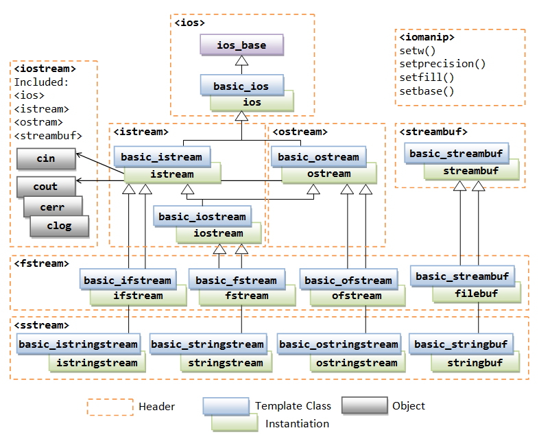
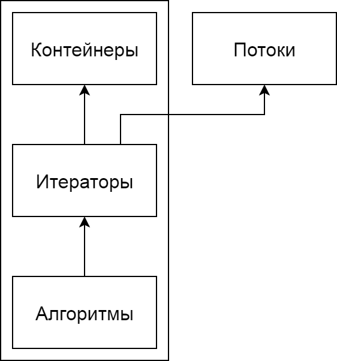
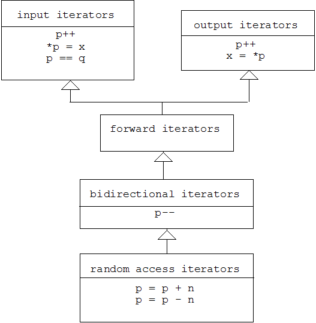

### Функтор (функциональный объект)

Объект ведущий себя подобно функции.

```c++
template <class T>
class Less
{
    const T& x_;
private:
    Less(const T& x)
        : x_(x)
    {
    }

    bool operator()(const T& y) const
    {
        return x_ < y;
    }
};

Less lessThen3(3);

bool result = lessThen3(5); // false
```

### Лямбда-функция

Краткая форма записи анонимных функторов.

```c++
auto lessThen3 = [](int y) { return 3 < y; };

bool result = lessThen3(5); // false
```

#### Лямбда - краткая форма анонимного функтора

```c++
int x = 3;
auto add3 = [x](int y) { return x + y; };
auto s = add3(5); // 8
```

```c++
class lambda__a123 // Сгенерированное имя
{
    int x_;
public:
    explicit sum(int x)
        : x_(x)
    {
    }

    int operator()(int y) const
    {
        return x_ + y;
    }
};
auto add3 = lambda__a123(3);
auto s = add3(5); // 8
```

### Стандартная библиотека С++

1. Ввод-вывод
2. Многопоточность
3. Регулярные выражения
4. Библиотека С
5. Библиотека шаблонов STL
6. Прочее (дата и время, обработка ошибок, поддержка локализации и т.д.)

> Документация: [https://en.cppreference.com/w/](https://en.cppreference.com/w/)

### Потоки ввода-вывода



### Файловый ввод-вывод

```c++
#include <fstream>
```

##### std::ifstream

Чтение из файла.

```c++
std::ifstream file("/tmp/file.txt");
if (!file)
{
    std::cout << "can't open file" ;
    return;
}

while (file.good())
{
    std::string s;
    file >> s;
}
```

```c++
const int size = 1024;
char buf[size];

std::ifstream file("/tmp/file.data", std::ios::binary);
file.read(buf, size);
const auto readed = file.gcount();
```

##### std::ofstream

Запись в файл.

```c++
std::ofstream file("/tmp/file.txt");
if (!file)
{
    std::cout << "can't open file" ;
    return;
}

file << "abc" << 123;
```

```c++
const int size = 1024;
char buf[size];

std::ofstream file("/tmp/file.data", std::ios::binary);
file.write(buf, size);
```

### Вспомогательные классы

#### std::pair

Тип позволяющий упаковать два значения в один объект.

```c++
#include <utility>

auto p1 = std::pair<int, double>(1, 2.0);
auto p2 = std::make_pair(1, 2.0);

auto x = p1.first; // int == 1
auto y = p1.second; // double == 2
```

> pair имеет операторы сравнения позволяющие сделать лексикографическое сравнение элементов.

#### std::tuple

Тип позволяющий упаковать несколько значений в один объект.

```c++
#include <tuple>

auto t = std::make_tuple(1, 2.0, "abc");
int a = std::get<0>(t);
double b = std::get<1>(t);
std::string c = std::get<2>(t);
```

> Соответствие типов проверяется на этапе компиляции.

> Как и pair имеет лексикографические операторы сравнения.

#### std::tie

tie, как и make_tuple создает tuple, но не объектов, а ссылок на них.

##### Использование tie для написания операторов сравнения

```c++
struct MyClass
{
    int x_;
    std::string y_;
    double z_;
    
    bool operator<(const MyClass& o) const
    {
        return std::tie(x_, y_, z_) < std::tie(o.x_, o.y_, o.z_);
    }
};
```

```c++
bool operator<(const MyClass& o) const
{
    if (x_ != o.x_)
        return x_ < o.x_;
    if (y_ != o.y_)
        return y_ < o.y_;
    return z_ < o.z_;
}
```

### Библиотека шаблонов STL (Standard Template Library)

1. Контейнеры (containers) – хранение набора объектов в памяти
2. Итераторы (iterators) – средства для доступа к источнику данных (контейнер, поток)
3. Алгоритмы (algorithms) – типовые операции с данными
4. Адаптеры (adaptors) – обеспечение требуемого интерфейса
5. Функциональные объекты (functors) – функция как объект для использования другими компонентами



### O большое

«О» большое – математическое обозначение для сравнения асимптотического поведения алгоритма.

Фраза «сложность алгоритма есть O(f(n))» означает, что с ростом параметра n время работы алгоритма будет возрастать не быстрее, чем некоторая константа, умноженная на f(n).

Типичные значения:

1. Время выполнения константно: O(1)
2. Линейное время: O(n)
3. Логарифмическое время: O(log n)
4. Время выполнения «n логарифмов n»: O(n log n)
5. Квадратичное время: O(n<sup>2</sup>)

### Контейнеры

1. Последовательные (Sequence containers)
2. Ассоциативные (Associative containers)
3. Неупорядоченные ассоциативные (Unordered associative containers)
4. Контейнеры-адаптеры (Container adaptors)

### Последовательные контейнеры

#### std::array

```c++
#include <array>

template <class T, std::size_t N>
class array
{
    T data_[N];
    size_t size_;
public:
    using size_type = size_t;
    using value_type = T;
    using reference = T&;
    using const_reference = const T&;

    constexpr size_type size() const noexcept
    {
        return size_;
    }

    constexpr bool empty() const noexcept
    {
        return false;
    }

    reference at(size_type pos)
    {
        if (size_ <= pos)
            throw std::out_of_range(std::to_string(pos));
        return data_[pos];
    }

    constexpr const_reference at(size_type pos) const;

    reference operator[](size_type pos)
    {
        return data_[pos];
    }

    constexpr const_reference operator[](size_type pos) const;

    reference front()
    {
        return data_[0];
    }

    constexpr const_reference front() const;

    reference back()
    {
        return data_[size_ - 1];
    }

    constexpr const_reference back() const;

    T* data() noexcept
    {
        return data_;
    }

    const T* data() const noexcept;

    void swap(array<T, N>& other);
};
```

| Вставка | Удаление | Поиск | Доступ |
| ------- | -------- | ----- | ------ |
| -       | -        | O(n)  | O(1)   |

```c++
std::array<int, 5> a = { 1, 2, 3, 4, 5 };
auto x = a[2];
a[2] = x * 2;
```

#### std::initializer_list

```c++
template <class T>
class initializer_list
{
public:
    size_type size() const noexcept;
    const T* begin() const noexcept;
    const T* end() const noexcept;
};
```

```c++
Array<int, 3> a = { 1, 2, 3 };
```

```c++
template <class T, size_t N>
class Array
{
public:
    Array(std::initializer_list<T> init)
    {
        size_t i = 0;
        auto current = init.begin();
        const auto end = init.end();
        while (current != end)
        {
            data_[i++] = *current++;
        }
    }
};
```

#### std::vector

```c++
template<class T,
    class Alloc = std::allocator<T>>
class vector
{
public:
    using size_type = size_t;
    using value_type = T;
    using reference = T&;
    using const_reference = const T&;
	using allocator_type = Alloc;

    explicit vector(size_type count);
    vector(size_type count, const value_type& defaultValue);
    vector(initializer_list<value_type> init);

    iterator begin() noexcept;
    reverse_iterator rbegin() noexcept;
    const_iterator cbegin() const noexcept;
    const_reverse_iterator crbegin() const noexcept;

    iterator end() noexcept;
    reverse_iterator rend() noexcept;
    const_iterator cend() const noexcept;
    const_reverse_iterator crend() const noexcept;

    void push_back(value_type&& value);
    void push_back(const value_type& value);

    template<class... VT>
    void emplace_back(VT&&... values);

    iterator insert(const_iterator where, T&& value);
    iterator insert(const_iterator where, const T& value);

    template<class... VT>
    iterator emplace(const_iterator where, VT&&... values);

    void reserve(size_type count); // Выделяет память
    size_type capacity() const noexcept;

    void resize(size_type newSize); // Изменяет размер
    void resize(size_type newsize, const value_type& defaultValue);

    iterator erase(const_iterator where);

    // [from, to)
    iterator erase(const_iterator from, const_iterator to);

    void clear() noexcept;
};
```

##### emplace_back vs push_back(&&)

```c++
class A
{
    A(int, int) {}
    A(A&&) {}
};

A a(1, 2);

vec.push_back(std::move(a));
vec.emplace(1, 2);
```

Вектор - динамический массив, при добавлении элементов может изменять размер.

| Вставка               | Удаление     | Поиск                      | Доступ |
| --------------------- | ------------ | -------------------------- | ------ |
| O(n)                  | O(n)         | O(n)                       | O(1)   |
| В конце O(1) или O(n) | В конце O(1) | В отсортированном O(log n) |        |

#### Трюки с вектором

##### Быстрое удаление O(1)

Если порядок элементов не важен, то меняем удаляемый элемент с последним местами и удаляем последний (pop_back). 

##### Изменение размера вектора перед вставкой

```c++
const auto size = file.size();
std::vector<char> data(size);
for (size_t i = 0; i < size; ++i)
    data[i] = file.read();
```

Позволяет сократить количество переаллокаций и существенно ускорить код.

##### Очистка вектора

```c++
std::vector<int> data;
for (int i = 0; i < 100500; ++i)
    data.push_back(i);
data.clear();
std::cout << data.capacity() << std::endl; // >= 100500
data.swap(std::vector<int>());
std::cout << data.capacity() << std::endl; // 0
```

```c++
data.shrink_to_fit(); // C++11
```

#### Итераторы (iterators)

Объект предоставляющий доступ к элементам коллекции и осуществляющий навигацию по ним.

Позволяет реализовать универсальные алгоритмы работы с контейнерами.

Классификация итераторов:

- Ввода (Input Iterator)
- Однонаправленные (Forward Iterator)
- Двунаправленные (Bidirectional Iterator)
- Произвольного доступа (Random Access Iterator)
- Вывода (Output Iterator)



```c++
template <class T, size_t N>
class Array
{
    T data_[N];
};
```

```c++
template<
    typename _Category,
    typename _Tp, 
    typename _Distance = ptrdiff_t,
    typename _Pointer = _Tp*,
    typename _Reference = _Tp&>
struct iterator
{
    /// One of the @link iterator_tags tag types@endlink.
    typedef _Category  iterator_category;
    /// The type "pointed to" by the iterator.
    typedef _Tp        value_type;
    /// Distance between iterators is represented as this type.
    typedef _Distance  difference_type;
    /// This type represents a pointer-to-value_type.
    typedef _Pointer   pointer;
    /// This type represents a reference-to-value_type.
    typedef _Reference reference;
};
```

```c++
template <class T>
class Iterator
    : public std::iterator<std::forward_iterator_tag, T>
{
    T* ptr_;
public:
    using reference = T&;

    explicit Iterator(T* ptr)
        : ptr_(ptr)
    {
    }

    bool operator==(const Iterator<T>& other) const
    {
        return ptr_ == other.ptr_;
    }

    bool operator!=(const Iterator<T>& other) const
    {
        return !(*this == other);
    }

    reference operator*() const
    {
        return *ptr_;
    }

    Iterator& operator++()
    {
        ++ptr_;
        return *this;
    }
};
```

```c++
template <class T, size_t N>
class Array
{
    T data_[N];
public:
    using iterator = Iterator<T>;

    iterator begin() noexcept
    {
        return iterator(data_);
    }

    iterator end() noexcept
    {
        return iterator(data_ + N);
    }
};
```
```c++
Array<int, 5> arr;
for (auto i : arr)
    std::cout << i;
    
Array<int, 5>::iterator it = arr.begin();
while (it != arr.end())
    ++it;
```

#### Адаптеры

```c++
#include <iterator>
```

##### reverse_iterator

```c++
template <class T>
using reverse_iterator = reverse_iterator<Iterator<T>>;

reverse_iterator rbegin() const noexcept
{
    return reverse_iterator(end());
}

reverse_iterator rend() const noexcept
{
    return reverse_iterator(begin());
}
```

##### back_insert_iterator

Вставляет элемент в конец контейнера (push_back).

```c++
std::vector<int> v;
std::back_insert_iterator<std::vector<int>> it = std::back_inserter(v);
*it = 5;
++it;
*it = 7;
// v == { 5, 7 }
```

##### front_insert_iterator

Вставляет элемент в начало контейнера (push_front).

##### insert_iterator

Вставляет элемент в указанное место (insert).

```c++
std::set<int> s;
std::insert_iterator<std::set<int>> it = std::inserter(s, s.end());
*s = 3;
```

#### Операции с итераторами

##### advance

Переместить итератор на n

```c++
std::advance(it, 4);
```

##### distance

Расстояние между двумя итераторами

```c++
auto n = std::distance(it1, it2);
```

#### Потоковые итераторы

Позволяют работать с потоком через интерфейс итератора.

##### ostream_iterator

```c++
auto it = std::ostream_iterator<int>(std::cout, " ");
*it = 3;
```

##### istream_iterator

```c++
auto it = std::istream_iterator<int>(std::cin);
int x = *it;
```

### Аллокаторы

Назначение аллокатора - выделять и освобождать память.

malloc и new - аллокаторы.

```c++
template<class T,
    class Alloc = std::allocator<T>>
class vector
{
};
```

```c++
template<class T>
class allocator
{
public:
    using value_type = T;
    using pointer = T*;
    using size_type = size_t;

    pointer allocate(size_type count);
    void deallocate(pointer ptr, size_type count);

    size_t max_size() const noexcept;
};
```

#### std::deque

Интерфейс повторяет интерфейс std::vector, отличие в размещении в памяти - std::vector хранит данные в одном непрерывном куске памяти, std::deque хранит данные в связанных блоках по n элементов.

```
std::vector
[ ][ ][ ][ ][ ][ ][ ]

std::deque
[ ][ ][ ]   [ ][ ][ ]
```

| Вставка               | Удаление              | Поиск                      | Доступ |
| --------------------- | --------------------- | -------------------------- | ------ |
| O(n)                  | O(n)                  | O(n)                       | O(1)   |
| В конце и начале O(1) | В конце и начале O(1) | В отсортированном O(log n) |        |

#### std::forward_list

Связный список, элементы которого храняться в произвольных участках памяти.

```c++
template <class T>
struct Node
{
    T value_;
    Node<T>* next_;
};

template <class T>
class List
{
    Node<T>* root_;
};
```
```c++
auto node = root_;
while (node != nullptr)
{
    node = node->next_;
}
```

| Вставка | Удаление | Поиск | Доступ |
| ------- | -------- | ----- | ------ |
| O(1)    | O(1)     | O(n)  | O(n)   |

Итератор списка не поддерживает произвольный доступ, следовательно алгоритмы STL, которые требуют random access iterator работать со списком не будут, например, std::sort

##### Нахождение петли в списке

Берем 2 итератора. Первый увеличиваем каждую итерацию на 1, второй на 2. Если итераторы на какой-либо итерации встретились - петля есть, если дошли до конца - петли нет.

#### std::list

Отличие от односвязного списка - возможность перемещаться в обратном направлении.

```c++
template <class T>
struct Node
{
    T value_;
    Node<T>* prev_;
    Node<T>* next_;
};
```

##### Разворот списка

Идем по списку и меняем местами значения prev и next.

### Ассоциативные контейнеры

Контейнер позволяющий хранить пары вида (ключ, значение) и поддерживающий операции добавления пары, а также поиска и удаления пары по ключу.

Элементы отсортированы по ключу:

- ```set<Key, Compare, Allocator>```
- ```map<Key, T, Compare, Allocator>```
- ```multiset<Key, Compare, Allocator>```
- ```multimap<Key, T, Compare, Allocator>```

Элементы не отсортированы:

- ```unordered_set<Key, Hash, KeyEqual, Allocator>```
- ```unordered_map<Key, T, Hash, KeyEqual, Allocator>```
- ```unordered_multiset<Key, Hash, KeyEqual, Allocator>```
- ```unordered_multimap<Key, T, Hash, KeyEqual, Allocator>```

set будем представлять как вырожденный случай map, где ключ равен значению.

В set и map ключи уникальны, в multi версиях контейнеров допускаются наличие значений с одинаковым ключом.

|                              | Вставка       | Удаление      | Поиск         | Доступ        |
| ---------------------------- | ------------- | ------------- | ------------- | ------------- |
| set, map                     | O(log n)      | O(log n)      | O(log n)      | O(log n)      |
| unordered_set, unordered_map | O(1) или O(n) | O(1) или O(n) | O(1) или O(n) | O(1) или O(n) |

```c++
#include <unordered_map>

std::unordered_map<std::string, size_t> frequencyDictionary;

std::string word;
while (getWord(word))
{
    auto it = frequencyDictionary.find(word);
    if (it == frequencyDictionary.end())
        frequencyDictionary[word] = 1;
    else
        it->second++;
}
```

### Контейнеры-адаптеры

Являются обертками над другими контейнерами и предоставляют нужный интерфейс.

- ```stack<T, Container = std::deque<T>>```
- ```queue<T, Container>```
- ```priority_queue<T, Container, Compare>```

#### std::stack

Реализует интерфейс стека - положить значение в стек, извлечь значение из стека, последний пришел первый вышел (LIFO).

```c++
#include <stack>

std::stack<int> s;
s.push(3);
s.push(5);
int x = s.top(); // 5
s.pop();
int y = s.top(); // 3
```

```c++
template<class T,
    class Container = std::deque<T> >
class stack
{
    Container data_;
public:
    using value_type = T;
    using size_type = typename Container::size_type;
    using reference = T&;
    using const_reference = const T&;

    void push(value_type&& value)
    {
        data_.push_back(std::move(value));
    }

    void push(const value_type& value)
    {
        data_.push_back(value);
    }

    template<class... VT>
    void emplace(VT&&... values)
    {
        data_.emplace_back(std::forward<VT>(values)...);
    }

    bool empty() const
    {
        return data_.empty();
    }

    size_type size() const
    {
        return data_.size();
    }

    reference top()
    {
        return data_.back();
    }

    const_reference top() const
    {
        return data_.back();
    }

    void pop()
    {
        data_.pop_back();
    }
};
```

#### std::queue

Реализует интерфейс очереди - положить значение в стек, извлечь первое значение из стека, первый пришел первый вышел (FIFO).

```c++
#include <queue>

template<
    class T,
    class Container = std::deque<T>>
class queue;
```
```c++
void push(const value_type& value);
void push(value_type&& value);
```
```c++
reference front();
const_reference front() const;
```
```c++
void pop();
```

#### std::priority_queue

Отличие от queue - за O(1) можно извлечь элемент наиболее полно удовлетворяющий условию.

```c++
#include <queue>

template<
    class T,
    class Container = std::vector<T>,
    class Compare = std::less<typename Container::value_type>>
class priority_queue;
```

```c++
struct Packet
{
    int priority_;
    std::string payload_;
};

auto PriorityComparator =
    [](const Packet& x, const Packet& y)
    {
        return x.priority_ > y.priority_;
    };

using PacketQueue = std::priority_queue
    <
        Packet,
        std::vector<Packet>,
        decltype(PriorityComparator)
    >;

PacketQueue incoming(PriorityComparator);
```

### Библиотека алгоритмов STL

1. Не изменяющие последовательные алгоритмы
2. Изменяющие последовательные алгоритмы
3. Алгоритмы сортировки
4. Бинарные алгоритмы поиска
5. Алгоритмы слияния
6. Кучи
7. Операции отношений

```c++
#include <algorithm>
```

#### Не изменяющие последовательные алгоритмы

Не изменяют содержимое последовательности и решают задачи поиска, подсчета элементов, установления равенства последовательностей.

##### adjacent_find

Возвращает итератор, указывающий на первую пару одинаковых объектов, если такой пары нет, то итератор - end.

```c++
std::vector<int> v { 1, 2, 3, 3, 4 };
auto i = std::adjacent_find(v.begin(), v.end());
// *i == 3
```

##### all_of

Проверяет, что все элементы последовательности удовлетворяют предикату.

```c++
std::vector<int> v { 1, 2, 3, 4 };
if (std::all_of(v.begin(), v.end(), [](int x) { return x < 5; }))
    std::cout << "all elements are less than 5";
```

##### any_of

Проверяет, что хоть один элемент последовательности удовлетворяет предикату.

##### none_of

Проверяет, что все элементы последовательности не удовлетворяют предикату.

##### count, count_if

Возвращает количество элементов, значение которых равно value или удовлетворяет предикату.

```c++
std::vector<int> v { 3, 2, 3, 4 };
auto n = std::count(v.begin(), v.end(), 3); 
// n == 2
```

##### equal

Проверяет, что две последовательности идентичны.

```c++
bool isPalindrome(const std::string& s)
{
    auto middle = s.begin() + s.size() / 2;
    return std::equal(s.begin(), mid, s.rbegin());
}

isPalindrome("level"); // true
```

Есть версия принимающая предикат.

##### find, find_if, find_if_not

Находит первый элемент последовательности удовлетворяющий условию.

##### find_end

Находит последний элемент последовательности удовлетворяющий условию.

##### find_first_of

Ищет в первой последовательности первое вхождение любого элемента из второй последовательности.

```c++
std::vector<int> v { 0, 2, 3, 25, 5 };
std::vector<int> t { 3, 19, 10, 2 };

auto result = std::find_first_of(
    v.begin(), v.end(), 
    t.begin(), t.end());

if (result == v.end())
    std::cout << "no matches found\n";
else
    std::cout << "found a match at "
        << std::distance(v.begin(), result) << "\n";
}

// found a match at 1
```

##### for_each

Вызывает функцию с каждым элементом последовательности.

```c++
std::vector<int> v { 3, 2, 3, 4 };
auto print = [](int x) { std::cout << x; };
std::for_each(v.begin(), v.end(), print);
```

##### search

Ищет вхождение одной последовательности в другую последовательность.

##### search_n

Возвращает итератор на начало последовательности из n одинкаовых элементов или end.

```c++
auto it = search_n(data.begin(), data.end(), howMany, value);
```

##### mismatch

Возвращает пару итераторов на первое несовпадение элементов двух последовательностей.

```c++
std::vector<int> x { 1, 2 };
std::vector<int> y { 1, 2, 3, 4 };
auto pair = std::mismatch(x.begin(), x.end(), y.begin());
// pair.first == x.end()
// pair.second = y.begin() + 2
```

#### Модифицирующие последовательные алгоритмы

Изменяют содержимое последовательности, решают задачи копирования, замены, удаления, перестановки значений и т.д.

##### copy, copy_if, copy_n

Копируют диапазон последовательности в новое место.

```c++
std::vector<int> data { 1, 2, 3, 4 };
std::copy(data.begin(), data.end(),
    std::ostream_iterator<int>(std::cout, " "));
```

```c++
std::vector<int> data { 1, 2, 3, 4 };
std::vector<int> out;
std::copy(data.begin(), data.end(), std::back_inserter(out));
```

```c++
char* source = ...;
size_t size = 1024;
char* destination = ...;
std::copy(source, source + size, destination);
```

##### copy_backward

Аналогично copy, но в обратном порядке.

##### move, move_backward

Аналогично copy, но вместо копирования диапазона используется перемещение.

##### fill, fill_n

Заполнение диапазона значениями.

```c++
std::vector<int> data { 1, 2, 3, 4 };
std::fill(data.begin(), data.end(), 0);
```

##### generate, generate_n

Заполнение сгенерированными значениями.

```c++
std::vector<int> randomNumbers;
auto iter = std::back_inserter(randomNumbers);
std::generate_n(iter, 100, std::rand);
```

##### remove, remove_if

Удаляет элементы удовлетворяющие критерию. Если быть точным данные алгоритмы ничего не удаляют, просто изменяют последовательность так, чтобы удаляемые элементы были в конце и возвращают итератор на первый элемент.

```c++
std::string str = "Text\t with\t \ttabs";
auto from = std::remove_if(
    str.begin(), str.end(),
    [](char x) { return x == '\t'; })
// Text with tabs\t\t\t
str.erase(from, str.end());
// Text with tabs
```

##### remove_copy, remove_copy_if

То же, что и remove, но то, что не должно удаляться копируется в новое место.

```c++
std::string str = "Text with   spaces";
std::remove_copy(str.begin(), str.end(),
    std::ostream_iterator<char>(std::cout), ' ');
```

```
Textwithspaces
```

##### replace, replace_if

Заменяет элементы удовлетворяющие условию в последовательности.

```c++
std::string str = "Text\twith\ttabs";
std::replace_if(str.begin(), str.end(),
    [](char x) { return x == '\t'; }, ' ');
```

##### reverse

Поворачивает элементы последовательности задом наперед.

##### swap

Меняет два элемента местами.

```c++
int x = 3;
int y = 5;
std::swap(x, y);
```

##### iter_swap

Меняет два элемента на которые указывают итераторы местами.

##### swap_ranges

Меняет местами два диапазона последовательностей.

##### shuffle

Перемешивает диапазон последовательности.

```c++
std::vector<int> v = {1, 2, 3, 4, 5, 6, 7, 8, 9, 10};
 
std::random_device rd;
std::mt19937 gen(rd());
 
std::shuffle(v.begin(), v.end(), gen);
```

##### unique

Удаляет (аналогично remove) дубликаты в последовательности, последовательность должна быть отсортирована.

```c++
std::vector<int> v { 1, 1, 2, 3, 3 };
const auto from = std::unique(v.begin(), v.end());
// 1 2 3 1 3
v.erase(from, v.end());
// 1 2 3
```

#### Алгоритмы сортировки

##### is_sorted

Проверяет упорядочена ли последовательность.

```c++
std::vector<int> v = { 1, 2, 3 };
const bool isSoreted = 
    std::is_sorted(v.begin(), v.end());
// true
```

##### sort

Сортирует последовательность.

```c++
std::vector<int> v = { 2, 3, 1 };
std::sort(v.begin(), v.end(), 
    [](int x, int y) { return x > y; });
// 3 2 1
```

> Сложность O(n * log n)

##### partial_sort

Сортирует часть последовательности (TOP-N).

```c++
std::array<int, 10> s { 5, 7, 4, 2, 8, 6, 1, 9, 0, 3 };
std::partial_sort(s.begin(), s.begin() + 3, s.end());
```

```
0 1 2 7 8 6 5 9 4 3
```

> Сложность O((last-first) * log (middle-first))

##### stable_sort

Сортирует последовательность, если два объекта равны, их порядок не изменится.

> Сложность O(n * log<sup>2</sup> n)

##### nth_element

Помещает элемент в позицию n, которую он занимал бы после сортировки всего диапазона.

```c++
std::vector<int> v { 3, 1, 4, 5, 2 };
const auto medianIndex = v.size() / 2;
std::nth_element(v.begin(), v.begin() + medianIndex, v.end());
const auto median = v[medianIndex];
// 3
```

> Сложность O(n)

#### Алгоритмы бинарного поиска

Последовательности к которым применяются алгоритмы должны быть отсортированы.

##### binary_search

Поиск по отсортированной последовательности.

```c++
std::vector<int> v { 1, 2, 3, 4, 5 };
bool has2 = std::binary_search(v.begin(), v.end(), 2);
// true
```

##### lower_bound

Возвращает итератор, указывающий на первый элемент, который не меньше, чем value.

```c++
std::vector<int> v { 1, 2, 3, 4, 5 };
//                      ^
auto it = std::lower_bound(v.begin(), v.end(), 2);
```

##### upper_bound

Возвращает итератор, указывающий на первый элемент, который больше, чем value.

```c++
std::vector<int> v { 1, 2, 3, 4, 5 };
//                         ^
auto it = std::upper_bound(v.begin(), v.end(), 2);
```

##### equal_range

Возвращает такую пару итераторов, что элемент на который указывает первый итератор не меньше value, а элемент на который указывает второй итератор больше value.

```c++
std::vector<int> v { 1, 2, 3, 4, 5 };
//                      ^  ^
auto pair = std::equal_range(v.begin(), v.end(), 2);
```

### Практическая работа

Написать свой контейнер Vector аналогичный std::vector, аллокатор и итератор произвольного доступа для него. Из поддерживаемых методов достаточно operator[], push_back, pop_back, empty, size, clear, begin, end, rbegin, rend, resize, reserve.

Чтобы тесты проходили, классы должны иметь такие имена:

```c++
template <class T>
class Allocator
{
};

template <class T>
class Iterator
{
};

template <class T, class Alloc = Allocator<T>>
class Vector
{
public:
    using iterator = Iterator<T>;

private:
    Alloc alloc_;
};
```

Интерфейс аллокатора и итератора смотрите в документации.

#### Как безопасно увеличить буфер

```c++
template <class T>
class Buffer
{
public:
    explicit Buffer(size_t initialSize = 1024)
        : data_(new T[initialSize])
        , size_(initialSize)
    {
    }

    void resize(size_t newSize)
    {
        if (size_ < newSize)
        {
            auto newData = std::make_unique<T[]>(newSize);
            std::copy(data_.get(), data_.get() + size_, newData.get());
            data_.swap(newData);
            size_ = newSize;
            return;
        }

        assert(!"not implemented yet");
    }

private:
    std::unique_ptr<T[]> data_;
    size_t size_;
};
```

### После лекции я с ребятами написал в качестве примера итератор, который итерирует последовательность по четным числам, вот код:

```c++
#include <iostream>
#include <set>
#include <vector>

template <class Iter>
class OddIterator
    : public std::iterator<std::forward_iterator_tag, typename Iter::value_type>
{
    Iter current_;
    Iter end_;

    void findNext()
    {
        while (current_ != end_)
        {
            if (*current_ % 2 == 0)
                return;
            ++current_;
        }
    }

public:
    OddIterator(Iter&& begin, Iter&& end)
        : current_(std::move(begin))
        , end_(std::move(end))
    {
        findNext();
    }

    bool operator==(const OddIterator& other) const
    {
        return current_ == other.current_;
    }

    bool operator!=(const OddIterator& other) const
    {
        return !(*this == other);
    }

    void operator++()
    {
        if (current_ != end_)
        {
            ++current_;
            findNext();
        }
    }

    int operator*() const
    {
        return *current_;
    }
};

template <class Container>
OddIterator<typename Container::const_iterator> getBegin(const Container& data)
{
    return OddIterator<typename Container::const_iterator>(data.cbegin(), data.cend());
}

template <class Container>
OddIterator<typename Container::const_iterator> getEnd(const Container& data)
{
    return OddIterator<typename Container::const_iterator>(data.cend(), data.cend());
}

int main()
{
    std::vector<int> data1 = { 9, 8, 1, 3, 4, 5, 6 };
    std::for_each(getBegin(data1), getEnd(data1), [](int x) { std::cout << x << '\n'; });

    std::cout << '\n';

    std::set<int> data2(data1.begin(), data1.end());
    std::for_each(getBegin(data2), getEnd(data2), [](int x) { std::cout << x << '\n'; });

    return 0;
}
```

EOF
