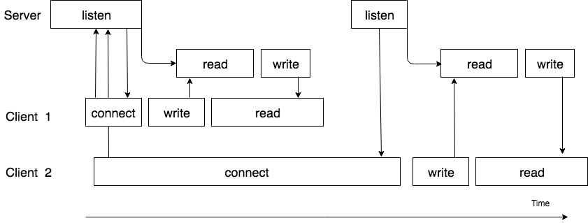
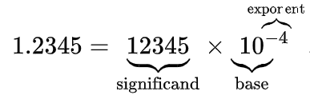
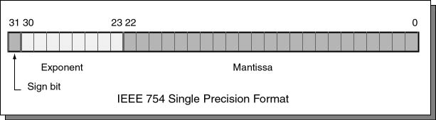
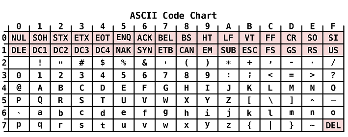
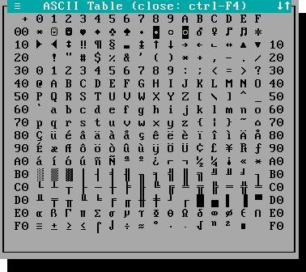
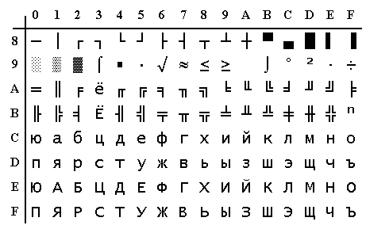
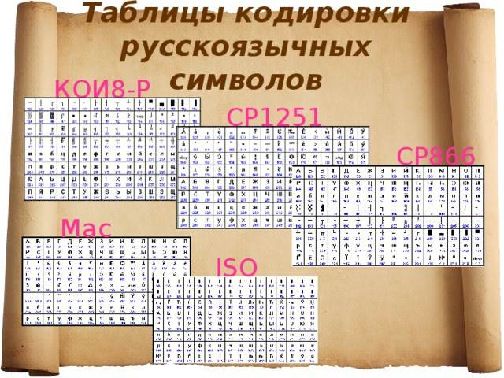
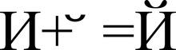
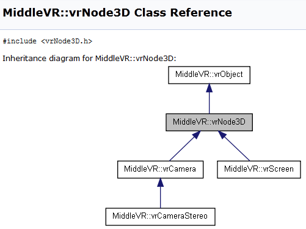

#### std::call_once

Проинициализировать что-либо потокобезопасно один раз.

```c++
std::unique_ptr<Display> display;

void print(const std::string& message)
{
    if (!display)
        display.reset(new Display());
    display->print(message);
}
```

```c++
std::unique_ptr<Display> display;

static std::once_flag displayInitFlag;

void print(const std::string& message)
{
    std::call_once(displayInitFlag,
        []() { display.reset(new Display()); });
    display->print(message);
}
```

#### thread_local

Хранилище уровня потока (с++11).

- Создается когда запускается поток
- Уничтожается когда поток завершает работу
- Для каждого потока свое

```c++
static thread_local std::map<std::string, int> threadCache;
```

#### Задача об обедающих философах

n философов сидят за столом, перед каждым тарелка с едой, между тарелками лежит по 1 палочке. Чтобы поесть, надо взять 2 палочки, то есть философ должен взять палочку слева и справа от своей тарелки.


1. Философы не вежливые

Философ взял правую палочку и не отдает, левую палочку взял сосед и тоже не отдает - произошла взаимная блокировка (deadlock).

2. Философы вежливые

Философ взял правую палочку, посмотрел, что левая занята соседом, положил правую, подумал, повторил с начала. Остальные поступают аналогично. Если все думают одинаковое время, то никто из них не сможет поесть (livelock).

3. Философы слишком быстро едят

Поэтому палочка либо слева, либо справа все время занята и философ голодает (starvation).

#### Решение задачи

1. Иерархия ресурсов

Надо пронумеровать палочки, далее философы берут палочку с наименьшим номером, затем с наибольшим, возращают палочки в обратном порядке. Если n - 1 философов взяли палочке, то останется одна с наибольшим номером, поэтому ее последний философ взять не сможет. Один из взявших палочку берет палочку с наибольшим номером, затем возвращает ее, позволяя поесть следующему.

2. Официант

По запросу выдает палочки или предлагает подождать, если все палочки заняты.

```c++
#include <cassert>
#include <condition_variable>
#include <mutex>
#include <thread>
#include <vector>

class Steward
{
public:
    explicit Steward(size_t maxPhilosophers)
        : maxPhilosophers_(maxPhilosophers)
        , busyChopsticks_(maxPhilosophers)
    {
    }

    using Chopsticks = std::pair<size_t, size_t>;

    Chopsticks getChopsticks(size_t philosopher)
    {
        assert(philosopher < maxPhilosophers_);
        const auto chopsticks = getChopstickNumbers(philosopher);

        std::unique_lock<std::mutex> lock(mutex_);

        while (busyChopsticks_[chopsticks.first] == true
            || busyChopsticks_[chopsticks.second] == true)
        {
            chopsticksAreBack_.wait(lock);
        }

        busyChopsticks_[chopsticks.first] = true;
        busyChopsticks_[chopsticks.second] = true;

        return chopsticks;
    }

    void returnChopsticks(Chopsticks chopsticks)
    {
        {
            std::lock_guard<std::mutex> lock(mutex_);

            busyChopsticks_[chopsticks.first] = false;
            busyChopsticks_[chopsticks.second] = false;
        }

        chopsticksAreBack_.notify_all();
    }

private:
    const size_t maxPhilosophers_;

    std::vector<bool> busyChopsticks_;

    std::mutex mutex_;
    std::condition_variable chopsticksAreBack_;

    Chopsticks getChopstickNumbers(size_t philosopher)
    {
        // | P0 | P1 | P2 |
        // 0    1    2    3
        return std::make_pair(philosopher, philosopher + 1);
    }
};

int main()
{
    const size_t maxPhilosophers = 300;

    Steward steward(maxPhilosophers);

    std::vector<std::thread> philosophers;
    for (size_t i = 0; i < maxPhilosophers; ++i)
    {
        philosophers.emplace_back(
            [i, &steward]()
            {
                const auto chopsticks = steward.getChopsticks(i);
                // eat
                steward.returnChopsticks(chopsticks);
            });
    }

    for (auto& t : philosophers)
    {
        t.join();
    }

    return 0;
}
```

```c++
#include <mutex>
#include <thread>
#include <vector>

int main()
{
    const size_t maxPhilosophers = 300;

    using Chopstick = std::mutex;

    std::vector<Chopstick> chopsticks(maxPhilosophers + 1);

    std::vector<std::thread> philosophers;
    for (size_t i = 0; i < maxPhilosophers; ++i)
    {
        philosophers.emplace_back(
            [i, &chopsticks]()
            {
                const auto left = i;
                std::lock_guard<Chopstick> leftLock(chopsticks[left]);

                const auto right = i + 1;
                std::lock_guard<Chopstick> rightLock(chopsticks[right]);

                // eat
            });
    }

    for (auto& t : philosophers)
    {
        t.join();
    }

    return 0;
}
```

#### Проблема спящего парикмахера

Цель - парикмахер должен работать когда клиенты есть и спать, когда их нет. Клиент прийдя в парикмахерскую, если парикмахер свободен стрижется, если занят, то идет в приемную и там садится на стул и ждет, если свободных стульев нет, то уходит.

Producer–consumer problem - частный случай этой задачи.

```c++
struct Client {};

std::mutex barbershop;
std::condition_variable hasClient;

const size_t ChairsNum = 5;

std::queue<Client> clients;

bool clientCame(Client c)
{
    {
        std::unique_lock<std::mutex> lock(barbershop);

        if (clients.size() == ChairsNum)
            return false;

        clients.push(c);
    }

    hasClient.notify_one();

    return true;
}

void barberThread()
{
    while (true)
    {
        Client c;
        {
            std::unique_lock<std::mutex> lock(barbershop);
            while (clients.empty())
            {
                hasClient.wait(lock);
            }
            c = clients.front();
            clients.pop();
        }
        trim(c);
    }
}
```

### Потокобезопасные интерфейсы

```c++
template <class T>
class queue
{
    bool empty() const;
    T pop();
};

queue<Task> tasks;

if (!tasks.empty())
    process(tasks.pop());
```

```c++
template <class T>
class ThreadSafeQueue
{
    bool tryPop(T& value)
    {
        std::lock_guard<std::mutex> lock(mutex);
        if (data_.empty())
            return false;
        value = data_.front();
        data_.pop();
        return true;
    }
};

ThreadSafeQueue<Task> tasks;

Task task;
if (tasks.tryPop(task))
    process(task);
```

#### Задача о читателях-писателях

```c++
#include <mutex>
#include <unordered_map>

template <class Key, class Value>
class ThreadSafeCache
{
    std::unordered_map<Key, Value> cache_;
    std::mutex mutex_;
public:
    void put(const Key& key, const Value& val)
    {
        std::lock_guard<std::mutex> lock(mutex_);
        cache_.insert_or_assign(key, val);
    }

    void put(const Key& key, Value&& val)
    {
        std::lock_guard<std::mutex> lock(mutex_);
        cache_.insert_or_assign(key, val);
    }

    template <class... Args>
    void emplace(const Key& key, Args&&... args)
    {
        std::lock_guard<std::mutex> lock(mutex_);
        cache_.emplace(std::forward<Args>(args)...);
    }

    bool get(const Key& key, Value& val)
    {
        std::lock_guard<std::mutex> lock(mutex_);
        const auto it = cache_.find(key);
        if (it == cache_.end())
        {
            return false;
        }
        val = it->second;
        return true;
    }

    void erase(const Key& key)
    {
        std::lock_guard<std::mutex> lock(mutex_);
        cache_.erase(key);
    }
};
```

> Потоки желающие прочесть данные все равно выстраиваются в очередь на чтение, хотя чтение не требует такой синхронизации

Есть область памяти, позволяющая чтение и запись. Несколько потоков имеют к ней доступ, при этом одновременно могут читать сколько угодно потоков, но писать — только один. Как обеспечить такой режим доступа?

1. Приоритет читателя

Пока память открыта на чтение, давать читателям беспрепятственный доступ. Писатели могут ждать сколько угодно.

2. Приоритет писателя

Как только появился хоть один писатель, читателей больше не пускать. При этом читатели могут простаивать.

3. Одинаковый приоритет

Независимо от действий других потоков, читатель или писатель должен пройти барьер за конечное время.

##### Стратегии 1 и 2 чреваты голоданием потоков.

Голодание (starvation) — это более высокоуровневая проблема, чем гонки и взаимоблокировки. Материал для любознательных: [стратегии планирования задач](http://en.wikipedia.org/wiki/Category:Scheduling_algorithms)

#### shared_mutex (C++14)

```c++
#include <shared_mutex>

std::shared_mutex mutex;

void reader()
{
    std::shared_lock<std::shared_mutex> lock(mutex);
    // блокируется если есть unique_lock
    // не блокируется, если есть другие shared_lock
}

void writer()
{
    std::shared_lock<std::shared_mutex> lock(mutex);
    // получить эксклюзивный доступ на общих условиях
}
```

```c++
#include <shared_mutex>
#include <unordered_map>

template <class Key, class Value>
class ThreadSafeCache
{
    std::unordered_map<Key, Value> cache_;
    std::shared_mutex mutex_;
public:
    void put(const Key& key, const Value& val)
    {
        std::unique_lock<std::shared_mutex> lock(mutex_);
        cache_.insert_or_assign(key, val);
    }

    void put(const Key& key, Value&& val)
    {
        std::unique_lock<std::shared_mutex> lock(mutex_);
        cache_.insert_or_assign(key, val);
    }

    template <class... Args>
    void emplace(const Key& key, Args&&... args)
    {
        std::unique_lock<std::shared_mutex> lock(mutex_);
        cache_.emplace(std::forward<Args>(args)...);
    }

    bool get(const Key& key, Value& val)
    {
        std::shared_lock<std::shared_mutex> lock(mutex_);
        const auto it = cache_.find(key);
        if (it == cache_.end())
        {
            return false;
        }
        val = it->second;
        return true;
    }

    void erase(const Key& key)
    {
        std::unique_lock<std::shared_mutex> lock(mutex_);
        cache_.erase(key);
    }
};
```

##### Тесты производительности

|                     | Linux (4 core) | MacOS X (2 core) | Windows (4 core) |
|---------------------|----------------|------------------|------------------|
| Generating data     | 0.573          | 0.929            | 0.545            |
| Mutex               | 1.495          | 90.487           | 1.018            |
| Shared mutex        | 2.746          | 177.496          | 0.630            |

### Атомарные операции

std::atomic атомарно изменяет значение, гарантия, что изменение не приводит к блокировке есть только у atomic_flag

##### std::atomic_flag

```c++
// флаг сброшен
std::atomic_flag keepWorking = ATOMIC_FLAG_INIT;

// устанавливает флаг и возвращает предыдущее значение
keepWorking.test_and_set();

void threadFunc()
{
    while (keepWorking.test_and_set(std::memory_order_acquire)))
    {
    }
}

// сбросить флаг
keepWorking.clear(std::memory_order_release);
```

##### std::atomic<T>

```c++
std::atomic<int> i;

i.is_lock_free(); // true если изменение не приводит к блокировке

i.store(5);

int j = i.exchange(7); // возвращает предыдущее значение

int k = 7;

bool ok = i.compare_exchange_weak(k, 9);
// если i == k, то i станет равным 9 и вернется true, иначе в k будет
// записано актуальное значение и вернется false

ok = i.compare_exchange_strong(k, 9);
// аналогично compare_exchange_weak, но не бывает ложных срабатываний
// как если бы *this != expected

while (!i.compare_exchange_weak(k, 9)) ;
// compare_exchange_weak можно использовать в цикле, на некоторых архитектурах
// это дает более эффективный код
```

```c++
std::atomic<int> i;
int prev = i.fetch_add(5);

// fetch_sub
// fetch_and
// fetch_or
// fetch_xor
```

### Структуры данных без блокировок

mutex, condition_variable и аналогичные примитивы вызывают блокировку потока

```c++
class Spinlock
{
    std::atomic_flag lock_;
public:
    Spinlock()
        : lock_(ATOMIC_FLAG_INIT)
    {
    }

    void lock()
    {
        while (lock_.test_and_set()) ;
    }

    void unlock()
    {
        lock_.clear();
    }
};
```

Spinlock не блокирует поток, но приводит к блокировкам других потоков

#### Стек с блокировками

```c++
#include <mutex>
#include <stack>

template <class T>
class ThreadSafeStdStack
{
    std::stack<T> stack_;
    std::mutex mutex_;
public:
    void push(const T& val)
    {
        std::lock_guard<std::mutex> lock(mutex_);
        stack_.push(val);
    }

    bool pop(T& val)
    {
        std::lock_guard<std::mutex> lock(mutex_);
        if (stack_.empty())
        {
            return false;
        }
        val = stack_.top();
        stack_.pop();
        return true;
    }
};
```

```
head: [value, prev] -> [value, prev] -> [value, nullptr]
```

```c++
#include <mutex>

template <class T>
class ThreadSafeStack
{
    struct Node
    {
        T val_;
        Node* prev_;
    };

    Node* head_ = nullptr;

    std::mutex mutex_;
public:
    ~ThreadSafeStack()
    {
        T val;
        while (pop(val));
    }

    void push(const T& val)
    {
        std::lock_guard<std::mutex> lock(mutex_);
        auto newNode = new Node { val, head_ };
        head_ = newNode;
    }

    bool pop(T& val)
    {
        std::lock_guard<std::mutex> lock(mutex_);
        if (!head_)
        {
            return false;
        }
        val = head_->val_;
        auto toDelete = head_;
        head_ = head_->prev_;
        delete toDelete;
        return true;
    }
};
```

#### Lock free stack

```c++
#include <atomic>

template <class T>
class LockFreeStack
{
    struct Node
    {
        T val_;
        Node* prev_;
    };

    std::atomic<Node*> head_ = nullptr;

public:
    ~LockFreeStack()
    {
        T val;
        while (pop(val));
    }

    void push(const T& val)
    {
        auto newNode = new Node { val, head_.load() };
        while (!head_.compare_exchange_weak(newNode->prev_, newNode));
    }

    bool pop(T& val)
    {
        auto node = head_.load();
        while (node && !head_.compare_exchange_weak(node, node->prev_));
        if (!node)
        {
            return false;
        }
        val = node->val_;
        return true;
    }
};
```

##### Тесты производительности

|                     | Linux (4 core) | MacOS X (2 core) | Windows (4 core) |
|---------------------|----------------|------------------|------------------|
| Generating data     | 0.197          | 0.210            | 0.190            |
| Std mutex           | 3.550          | 98.250           | 0.647            |
| Mutex               | 9.188          | 101.779          | 1.531            |
| Lock free           | 1.962          | 1.069            | 1.441            |

Проблемы реализации:
 - Небезопасна с исключениями
 - Утечка памяти

```c++
#include <atomic>

template <class T>
class LockFreeStack
{
    struct Node
    {
        T val_;
        Node* prev_;
    };

    std::atomic<Node*> head_ = nullptr;

    std::atomic<int> threadsInPop = 0;

    std::atomic<Node*> deleteLater_ = nullptr;

    void cleanup()
    {
        auto toDelete = deleteLater_.load();
        while (toDelete)
        {
            auto tmp = toDelete;
            toDelete = tmp->prev_;
            delete tmp;
        }
        deleteLater_ = nullptr;
    }

public:
    ~LockFreeStack()
    {
        T val;
        while (pop(val));
    }

    void push(const T& val)
    {
        auto newNode = new Node { val, head_.load() };
        while (!head_.compare_exchange_weak(newNode->prev_, newNode));
    }

    bool pop(T& val)
    {
        ++threadsInPop;

        auto toDelete = head_.load();
        while (toDelete && !head_.compare_exchange_weak(toDelete, toDelete->prev_));
        if (!toDelete)
        {
            --threadsInPop;
            return false;
        }

        val = toDelete->val_;

        if (threadsInPop == 1)
        {
            delete toDelete;
            cleanup();
        }
        else
        {
            toDelete->prev_ = deleteLater_.load();
            while (!deleteLater_.compare_exchange_weak(toDelete->prev_, toDelete));
        }

        --threadsInPop;
        return true;
    }
};
```

Проблемы реализации:
 - Голодание - если нагрузка большая, то в pop всегда будет несколько потоков, таким образом память не будет освобождаться

##### Подсчет ссылок для освобождения памяти

Реализация из книги "Параллельное программирование на С++" Энтони Уильямса, листинг 7.12

```c++
#include <atomic>
#include <memory>

template<typename T>
class lock_free_stack
{
private:
    struct node;

    struct counted_node_ptr
    {
        int external_count;
        node* ptr;
    };

    struct node
    {
        std::shared_ptr<T> data;
        std::atomic<int> internal_count;
        counted_node_ptr next;
        node(T const& data_):
            data(std::make_shared<T>(data_)),
            internal_count(0)
        {}
    };

    std::atomic<counted_node_ptr> head;

    void increase_head_count(counted_node_ptr& old_counter)
    {
        counted_node_ptr new_counter;
        do
        {
            new_counter=old_counter;
            ++new_counter.external_count;
        }
        while(!head.compare_exchange_strong(
                  old_counter,new_counter,
                  std::memory_order_acquire,
                  std::memory_order_relaxed));
        old_counter.external_count=new_counter.external_count;
    }
public:
    ~lock_free_stack()
    {
        while(pop());
    }

    void push(T const& data)
    {
        counted_node_ptr new_node;
        new_node.ptr=new node(data);
        new_node.external_count=1;
        new_node.ptr->next=head.load(std::memory_order_relaxed);
        while(!head.compare_exchange_weak(
                  new_node.ptr->next,new_node,
                  std::memory_order_release,
                  std::memory_order_relaxed));
    }

    std::shared_ptr<T> pop()
    {
        counted_node_ptr old_head=
            head.load(std::memory_order_relaxed);
        for(;;)
        {
            increase_head_count(old_head);
            node* const ptr=old_head.ptr;
            if(!ptr)
            {
                return std::shared_ptr<T>();
            }
            if(head.compare_exchange_strong(
                   old_head,ptr->next,std::memory_order_relaxed))
            {
                std::shared_ptr<T> res;
                res.swap(ptr->data);
                int const count_increase=old_head.external_count-2;
                if(ptr->internal_count.fetch_add(
                       count_increase,std::memory_order_release)==-count_increase)
                {
                    delete ptr;
                }
                return res;
            }
            else if(ptr->internal_count.fetch_add(
                        -1,std::memory_order_relaxed)==1)
            {
                ptr->internal_count.load(std::memory_order_acquire);
                delete ptr;
            }
        }
    }
};
```

> Протестировать не удалось, так как реализация в книге падала с Segmentation fault

### Асинхронность

```c++
Server srv("localhost", 8000);

while (true)
{
    auto connection = srv.listen();
    while (connection.good())
    {
        auto data = connection.read();
        connection.write(data);
    }
}
```



### Асинхронность с колбеками

```
#include <boost/asio.hpp>
```

```c++
class server
{
    boost::asio::ip::tcp::acceptor acceptor_;
public:
    server(
        boost::asio::io_context& io_context, 
        short port)
        : acceptor_(
            io_context, 
            boost::asio::ip::tcp::endpoint(
                boost::asio::ip::tcp::v4(), port))
    {
        do_accept();
    }

private:
    void do_accept()
    {
        acceptor_.async_accept(
            [this](
                boost::system::error_code ec,
                boost::asio::ip::tcp::socket socket)
        {
            if (!ec)
            {
                std::make_shared<session>(
                    std::move(socket))->start();
            }

            do_accept();
        });
    }
};
```

```c++
class session
    : public std::enable_shared_from_this<session>
{
    tcp::socket socket_;
    const size_t max_length = 1024;
    char data_[max_length];
public:
    session(boost::asio::ip::tcp::socket socket)
        : socket_(std::move(socket))
    {
    }

    void start()
    {
        do_read();
    }

private:
    void do_read()
    {
        auto self(shared_from_this());
        socket_.async_read_some(
            boost::asio::buffer(data_, max_length),
            [this, self](
                boost::system::error_code ec, 
                std::size_t length)
        {
            if (!ec)
            {
                do_write(length);
            }
        });
    }

    void do_write(std::size_t length)
    {
        auto self(shared_from_this());
        boost::asio::async_write(
            socket_, 
            boost::asio::buffer(data_, length),
            [this, self](
                boost::system::error_code ec,
                std::size_t /*length*/)
        {
            if (!ec)
            {
                do_read();
            }
        });
    }
};
```

```c++
boost::asio::io_context io_context;
server s(io_context, 4000);
io_context.run();
```

### Арифметика

#### Целые отрицательные числа

```
[n][6][5][4][3][2][1][0]
```

##### Диапазон

Верхняя граница:

2^7 = 128

[0, 127]

Нижняя граница:

-(2^7 + 1)

[-128, 0]

```
  -1 == 0b11111111 
-128 == 0b10000000
```

#### Переполнение

```c++
uint8_t a = 255;
++a; // overflow
assert(a == 0);
--a; // underflow
assert(a == 255);
```

```c++
int8_t a = 127;
++a;
// ??? - UB
```

Иллюстрация неопределенного поведения:

```c++
#include <iostream>

int main()
{
    for(int i = 0; i < 10; ++i)
    {
        auto val = i * 1000000000;
        std::cout << i << ' ' << val << std::endl;
    }
}
```

```
0 0
1 1000000000
2 2000000000
3 -1294967296
4 -294967296
5 705032704
6 1705032704
7 -1589934592
8 -589934592
9 410065408
10 1410065408
11 -1884901888
12 -884901888
...
```

> Проверено на gcc -O2

#### Приведение знакового к беззнаковому

```c++
int8_t a = -1;
uint32_t b = a;
assert(b == 4294967295);
```

> Результат копирования знакового бита 

#### Сравнение знакового и беззнакового

```c++
uint32_t a = 10;
int32_t b = -1;
assert(a < b); // !!!
```

> Если один из аргументов беззнаковый, то он неявно приводится к знаковому.

### Плавающая точка

```c++
float f = 1.234e6;
```



#### Стандарт IEEE 754



#### Нормализованная форма

Такая форма, в которой мантисса без учёта знака находится на интервале [1; 10)

```
−158,08 = −0,15808 * 10^3
0,00129 = −0,129 * 10^−2
0,15 = 0,15 * 10^0
```

##### float

Одинарная точность

```
32 бита
Порядок (exponent) 8 бит
Мантисса (significand) 23 бита
Можно представить целое до 2^24 без потери точности
```

##### double

Двойная точность

```
64 бита
Порядок (exponent) 11 бит
Мантисса (significand) 52 бита
Можно представить целое до 2^53 без потери точности
```

#### Специальные значения

##### Inf (infinity)

Возникает при переполнении или делении не нуля на ноль.

##### NaN (not a number)

К операциям, приводящим к появлению NaN в качестве ответа, относятся:

- все математические операции, содержащие NaN в качестве одного из операндов;
- деление нуля на ноль;
- деление бесконечности на бесконечность;
- умножение нуля на бесконечность;
- сложение бесконечности с бесконечностью противоположного знака;
- вычисление квадратного корня отрицательного числа;
- логарифмирование отрицательного числа

> NaN не равен ни одному другому значению (даже самому себе); соответственно, самый простой метод проверки результата на NaN — это сравнение полученной величины с самой собой.

##### Ноль

Так как в нормализованной форме ноль невозможно представить единственным способом.

#### Сравнение чисел с плавающей точкой на равенство

```c++
double a = 10 / 3.;
double b = a;
const bool isEqual = a == b; // Ok
```

```c++
double a = ...;
double b = ...;
// const bool isEqual = a == b; ???
const bool isEqual = fabs(a – b) < 0.0001;
```

> Погрешность представления числа увеличивается с ростом самого этого числа

[https://randomascii.wordpress.com/2012/02/25/comparing-floating-point-numbers-2012-edition/](https://randomascii.wordpress.com/2012/02/25/comparing-floating-point-numbers-2012-edition/)

#### Арифметика с массивами чисел с плавющей точкой

> При сложении большого и малого чисел малое просто исчезнет

1. Сортируем массив по возрастанию
2. Получаем сумму от 0 до максимального положительного
3. Получаем сумму от 0 до минимального отрицательного
4. Складываем результаты 2 и 3

### Unicode

##### ASCII



##### ASCII 8



##### KOI8-R




##### Множество кодировок



- Unicode – стандарт, а не кодировка
- CodePoint – символ в таблице Unicode (U+xxxx, где xxxx шестнадцетеричное число, например, U+0410)
- На данный момент уже существует 9 версия стандарта
- Начиная с версии 2.0 кодовая область расширена за пределы 2^16
- В версии 6.0 описано 109 242 графических и 273 прочих символа


[http://www.unicode.org/](http://www.unicode.org/)


### UCS-2

```
H      E      L      L      O
U+0048 U+0065 U+006C U+006C U+006F
```

```
00 48 00 65 00 6C 00 6C 00 6F (Big Endian)
    или
48 00 65 00 6C 00 6C 00 6F 00 (Little Endian)
```

### BOM (byte order mark)

##### UTF-8

```
EF BB BF
```

##### UTF-16

```
FE FF (Big Endian)
FF FE (Little Endian)
```

##### UTF-32

```
00 00 FE FF (Big Endian)
FF FE 00 00 (Little Endian)
```

### UTF-16

- Позволяет отобразить 2^20 + 2^16 − 2048 (1 112 064) символов
- Кодирует 0000..D7FF и E000..10FFFF (в виде суррогатных пар)
- Исключенный диапазон D800..DFFF используется как раз для кодирования суррогатных пар
- Суррогатная пара – символ кодируемый двумя 16 битными словами

### UTF-8

Переменное количество байт от 1 до 6
Позволяет закодировать 2^31 CodePoints

|Диапазон символов|Количество байт|
|---|---|
|00000000-0000007F|1|
|00000080-000007FF|2|
|00000800-0000FFFF|3|
|00010000-001FFFFF|4|
|00200000-03FFFFFF|5|
|04000000-7FFFFFFF|6|

### UTF-32, UCS-4

- Кодирует любой символ 4 байтами
- Позволяет индексировать 231 CodePoints
- Символы Юникод непосредственно индексируемы

# Но и это еще не все

### Модифицирующие символы

Графические символы в Юникоде подразделяются на протяжённые и непротяжённые (бесширинные). Непротяжённые символы при отображении не занимают места в строке. К ним относятся, в частности, знаки ударения и прочие диакритические знаки. Как протяжённые, так и непротяжённые символы имеют собственные коды. Протяжённые символы иначе называются базовыми (base characters), а непротяжённые — модифицирующими (combining characters); причём последние не могут встречаться самостоятельно. Например, символ «á» может быть представлен как последовательность базового символа «a» (U+0061) и модифицирующего символа « ́» (U+0301) или как монолитный символ «á» (U+00E1).



### Алгоритмы нормализации

Поскольку одни и те же символы можно представить различными кодами, сравнение строк байт за байтом становится невозможным. Алгоритмы нормализации (normalization forms) решают эту проблему, выполняя приведение текста к определённому стандартному виду. Приведение осуществляется путём замены символов на эквивалентные с использованием таблиц и правил. «Декомпозицией» называется замена (разложение) одного символа на несколько составляющих символов, а «композицией», наоборот, — замена (соединение) нескольких составляющих символов на один символ.

В стандарте Юникода определены 4 алгоритма нормализации текста: NFD, NFC, NFKD и NFKC.

### Что еще?

Например, двунаправленное письмо.

Стандарт Юникод поддерживает письменности языков как с направлением написания слева направо (left-to-right, LTR), так и с написанием справа налево (right-to-left, RTL) – например, арабское и еврейское письмо. В обоих случаях символы хранятся в «естественном» порядке; их отображение с учётом нужного направления письма обеспечивается приложением.

Кроме того, Юникод поддерживает комбинированные тексты, сочетающие фрагменты с разным направлением письма. 


И многое другое...

### ICU

[http://site.icu-project.org/](http://site.icu-project.org/)

### Инструменты

#### Valgrind

Заменяет стандартное выделение памяти своей реализацией отслеживающей корректное ее использование и освобождение. 

Позволяет определить:
- Попытки использования неинициализированной памяти
- Чтение/запись в память после её освобождения
- Чтение/запись за границами выделенного блока
- Утечки памяти

#### Статический анализ. CppCheck

Используется для статического анализа кода. Возможности:

1. Проверяет выход за пределы
2. Обнаруживает утечки памяти
3. Обнаруживает возможное разыменовывание NULL-указателей
4. Обнаруживает неинициализированные переменные
5. Обнаруживает неправильное использование STL
6. Проверяет обработку исключительных ситуаций на безопасность
7. Находит устаревшие и неиспользуемые функции
8. Предупреждает о неиспользуемом или бесполезном коде
9. Находит подозрительные участки кода, которые могут содержать в себе ошибки

```
[check.cpp:11]: (error) Array 'c[10]' index 10 out of bounds 
[check.cpp:5]: (error) Memory leak: __p 
[check.cpp:17]: (error) Memory leak: a 
[check.cpp:14]: (error) Mismatching allocation and deallocation: A::__p 
[check.cpp:8]: (error) Null pointer dereference 
```

### Doxygen

Документацию можно писать в коде. Doxygen проанализирует исходный код, построит документацию (html, latex и т.д.) из определений типов и дополнит ее найденными комментариями записанными в специальном формате:

```c++
/*!
Находит сумму двух чисел
@param a,b Складываемые числа
@return Сумму двух чисел, переданных в качестве аргументов
*/
double sum(const double a, const double b);
```


Если установлен Graphviz можно дополнить документацию графом вызовов и диаграммами наследования.



### Ускорение сборки

В разных единицах трансляции могут использоваться одни и те же заголовочные файлы – это приводит к многократной компиляции одного и того же кода.

Напрашивается идея собрать общие заголовочные файлы в один и скомпилировать их один раз – это предварительно откомпилированные заголовочные файлы (precompiled headers):

**stdafx.h**

```c++
#include <vector>
```

**a.cpp**

```c++
#include”stdafx.h” // Всегда первой строкой
#include “a.h”

...
```

При изменении stdafx.h или включенного в него заголовочного файла перекомпилируется весь проект!

### Домашнее задание

Выполнить сортировку бинарного файла содержащего числа uint64_t в 2 потока. Доступно 8 Мб памяти, больше выделять нельзя ни явно, ни неявно (например, в виде контейнеров), при этом файл может быть размером превышающим доступную память. Пространство на диске можно считать бесконечным. Сортировку выполнять в новый файл.

EOF
